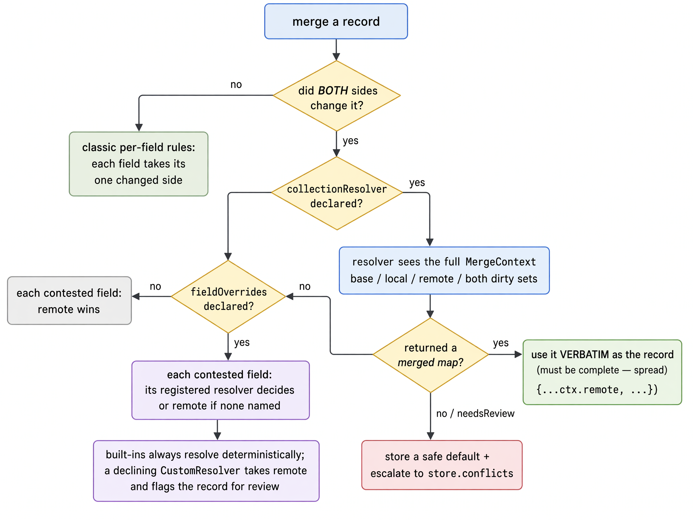

# LocalPocket

<p align="center">
  
</p>

- **A database**: SQLite FFI with an in-memory LRU point-read cache.
- **Strongly typed**: Schema-first strictly typed API.
- **Cross Platform**: One API on mobile/desktop/web — 0 boilerplate.
- **Durable**: ACID transactions via interactive `Transaction` objects, WAL mode (native), pluggable crash-safety levels.
- **Reactive**: Queries and single-record reads are watchable streams.
- **Synchronized**: Two-way sync with PocketBase over REST + SSE realtime.
- **Search**: Full-text search with SQLite FTS5.
- **Encrypted**: Built-in field-level AES-256-GCM encryption on every platform; whole-database encryption on native platforms.
- **Durable File Blobs**: content-addressed attachment storage with dedup and background lanes.
- **Battle-tested**: ~2700 unit/integration tests, 100+ live-server e2e scenarios, 45+ browser matrix runs on Chromium/Firefox/WebKit.
- **Migrations**: versioned, forward-only ledgers with safe destructive rebuilds and backups.
- **Conflict-aware**: deterministic 3-way merge engine with field-level resolvers.

---

## Installation

Add `localpocket` to your `pubspec.yaml`:

```yaml
dependencies:
  localpocket: ^0.1.1
```

---

## Quick Start

### Step 1: Store & Schema

```dart
import 'package:localpocket/localpocket.dart';

enum TaskStatus { todo, inProgress, done }

final class Tasks extends StoreDef<Tasks> {
  // ----- start with defining store name ----- //
  // define store name and schema version
  Tasks._private() : super(name: 'tasks', version: 1);
  // instantiate store as a static member
  static final Tasks store = Tasks._private();

  // Note:
  // Please note how we are constructing the class using
  // a private constructor (_private), accessed from static public property.
  // One Tasks per app: the private constructor means no code outside this
  // file can create a second instance. LocalPocket identifies stores by
  // identity, so a look-alike definition would compile but be rejected with
  // a store-mismatch error at open time — the private ctor makes that
  // failure impossible instead of just unlikely.

  // ----- define the schema per field ----- //
  static final title = store.schema
      .text(
        // field name
        'title',
        // unique constraint
        uniqueWhenActive: true,
      )
      .req(); // makes it required

  // Enums:
  static final status = store.schema.enumOf(
    'status',
    TaskStatus.values,
    wire: const {
      // overwriting the textual (string) representation of the enum
      TaskStatus.inProgress: 'in_progress',
      TaskStatus.todo: 'to_do'
      // unmapped values fallback to `.name`
    },
  );

  // ... defining schema for the rest of the fields ...
  static final priority = store.schema.integer('priority');
  static final done = store.schema.boolean('done');
  static final dueAt = store.schema.dateTime('due_at');
  // please refer to the table below for more field types

  // ----- define the ordered registry ----- //
  // declares which fields exist and in
  // what order they become columns
  // (`fields` is the ordered registry; each descriptor is built by the
  // store's `schema`, a `Fields<S>` factory)
  @override
  get fields => [title, status, priority, done, dueAt];

  // ----- define indexing (indexSpec builds an `IndexSpec`) ----- //
  @override
  get indexes => [
        indexSpec<Tasks>(
          [status, priority],
          scope: IndexScope.notArchived,
          unique: true,
        ),
      ];

  // ----- define search specs (ftsSpec builds an `FtsSpec`) ----- //
  @override
  get fts => ftsSpec<Tasks>(
        [title],
        fuzzy: true,
        normalize: const FtsNormalization(rules: {'à': 'a', 'ä': 'a'}),
      );

  // if an archived record hasn't syched yet
  // true: keep it in the local store.
  // false: delete it from the local store.
  // default: false
  @override
  bool get keepUnsyncedArchives => true;

  // Whether remote file references on this
  // store should be prefetched during sync pulls.
  // default: false
  @override
  bool get prefetchFiles => true;
}
```

#### Supported Field Types

| Descriptor factory   | value                               | SQLite storage        |
| -------------------- | ----------------------------------- | --------------------- |
| `schema.text`        | `String?` / `String` after `.req()` | `TEXT`                |
| `schema.integer`     | `int?` / `int` after `.req()`       | `INTEGER`             |
| `schema.real`        | `num?` / `num` after `.req()`       | `REAL`                |
| `schema.boolean`     | `bool?` / `bool` after `.req()`     | `INTEGER` (`0`/`1`)   |
| `schema.date`        | epoch-millisecond `int?`            | `INTEGER`             |
| `schema.dateTime`    | UTC `DateTime?`                     | `INTEGER`             |
| `schema.enumOf`      | Dart enum value                     | wire `TEXT`           |
| `schema.json`        | `Map<String, Object?>?`             | canonical JSON `TEXT` |
| `schema.jsonList<T>` | `List<T>?`                          | canonical JSON `TEXT` |
| `schema.ref`         | record-id `String?`                 | `TEXT`                |

#### Notes on field types:

- Enums are stored as strings. Unmapped values use `Enum.name`; the optional `wire` map pins stable alternatives such as `in_progress`.
- **`schema.date` vs `schema.dateTime`** — Both store the same epoch-**milliseconds** integer in an `INTEGER` column; only the boundary codec differs. `schema.date` is a pass-through adapter typed as `int?` (raw epoch ms, no conversion — you manage timezones) and supports numeric aggregates. `schema.dateTime` is typed as `DateTime?` and is **UTC-pinned in both directions**: local inputs are converted to UTC before storage and decoded values always have `isUtc == true`. The two adapters share the same column and are interchangeable on the wire. Prefer `schema.dateTime` for timestamps; use `schema.date` when you already hold epoch-ms integers or want `sum`/`min`/`max` over a date column.
- **`schema.integer` vs `schema.real`** — `schema.integer` is typed `int?` and stored as `INTEGER`; `schema.real` is typed `num?` (not `double` — Dart `int` values are accepted) and stored as `REAL`. Both support `.req()`, comparison operators, and numeric aggregates. Use `schema.integer` for counts/ids/whole numbers and `schema.real` for fractional measurements and percentages.
- **`schema.ref`** — Stores a **record id** (`String?`) pointing at a record in another store. There is no `.req()` (always optional) and no join/fetch API: read the id and fetch the target row from its own store.
- `enforceFk: true` adds a SQLite `REFERENCES` constraint on the column; ref fields not covered by a declared index are auto-indexed for lookups.

---

### Step 2: Models & Operations

While this step is optional, it is recommended to have a cleaner and more concise API.

```dart
// define a helper type for the row
typedef Task = Row<Tasks>;

// define and extension that maps each field in the row to a class member

extension TaskReads on Row<Tasks> {
  String get title => this(Tasks.title);

  // this can also have default values
  TaskStatus get status => this(Tasks.status) ?? TaskStatus.todo;
  bool get isDone => this(Tasks.done) ?? false;
  int get priority => this(Tasks.priority) ?? 0;

  // nullable fields can be accessed directly
  DateTime? get dueAt => this(Tasks.dueAt);

  // you can add fields based on whatever computations you want
  String get taskColor => status == TaskStatus.todo ? 'red' : 'blue';
}


// finally ...
// define common operations on your store
// the following example is quite verbose
// to show you the syntax and composability of the queries

extension TaskStore on Store<Tasks> {

  // ---- point reads
  Future<Task?> readTask(String id) => get(id);


  // ---- helper condiitions
  Cond<Tasks> get notDone => ~Tasks.done.eq(true);
  Cond<Tasks> get shipped => Tasks.done.eq(true);
  Cond<Tasks> get openOrOverdue =>
      (~Tasks.done.eq(true)) | Tasks.dueAt.lt(DateTime.now());

  // ---- queries: one shape, every terminal, any boolean tree
  Future<List<Task>> notDoneTasks({int limit = 50}) async => (await query(
        QuerySpec(
          where: [notDone],
          orderBy: [Tasks.priority.desc],
          limit: limit,
        ),
      ))
          .items;

  Future<List<Task>> highPriority({int limit = 50}) async => (await query(
        QuerySpec(
          where: [
            // Precedence: & binds tighter than | — parens make it explicit.
            (Tasks.priority.gt(0) & Tasks.priority.lt(2)) | shipped,
            Tasks.dueAt.lt(DateTime.now()) | Tasks.dueAt.eq(null),
          ],
          orderBy: [Tasks.priority.desc],
          limit: limit,
        ),
      ))
          .items;

  // An OR of ANDs — the shape a separate "OR group" could never express.
  Future<List<Task>> workable({int limit = 50}) async => (await query(
        QuerySpec(
          where: [
            Tasks.title.startsWith('Draft') |
                (Tasks.status.eq(TaskStatus.inProgress) & notDone),
          ],
          limit: limit,
        ),
      ))
          .items;

  Future<List<Task>> dueThisWeek() async {
    final now = DateTime.now().toUtc();
    return (await query(
      QuerySpec(
        where: [
          Tasks.dueAt.between(now, now.add(const Duration(days: 7))),
          notDone,
        ],
        orderBy: [Tasks.dueAt.asc],
        limit: Limits.unbounded,
      ),
    ))
        .items;
  }

  // Runtime-assembled filters: the where list ANDs its elements, and each
  // element may itself be a composed tree.
  Future<List<Task>> matching(
    List<Cond<Tasks>> filters, {
    int limit = 50,
  }) async =>
      (await query(
        QuerySpec(
          where: filters,
          orderBy: [Tasks.priority.desc],
          limit: limit,
        ),
      ))
          .items;

  // ---- writes: field-native values
  Future<void> newTask(String title, {int priority = 0}) => put([
        Tasks.title.set(title),
        Tasks.priority.set(priority),
        Tasks.done.set(false),
      ]);

  Future<void> newTaskWithId(String id, String title) =>
      put([Writes.id<Tasks>(id), Tasks.title.set(title)]);

  Future<void> markDone(String id) => patch(id, [Tasks.done.set(true)]);

  // null clears an optional field; on a .req() field it would not compile.
  Future<void> clearPriority(String id) =>
      patch(id, [Tasks.priority.set(null)]);

  Future<void> rename(String id, String newTitle) =>
      patch(id, [Tasks.title.set(newTitle)]);

  Future<void> seed(List<String> titles) => putAll([
        for (var i = 0; i < titles.length; i++)
          [
            Writes.id<Tasks>('task${(i + 1).toString().padLeft(11, '0')}'),
            Tasks.title.set(titles[i]),
            Tasks.priority.set(i),
            Tasks.status.set(TaskStatus.todo),
            Tasks.done.set(false),
          ],
      ]);

  Future<void> markAllDone(List<String> ids) => patchAll({
        for (final id in ids) id: [Tasks.done.set(true)],
      });

  // ---- lifecycle
  Future<void> archiveTask(String id) => archive(id);
  Future<void> restoreTask(String id) => restore(id);
  Future<void> deleteTask(String id) => purge(id);

  // ---- search: hits come straight back
  Future<void> printSearch(String term) async {
    for (final hit in await search(SearchSpec(term: term, limit: 10))) {
      final row = await hit.fetch();
      print(
        '  hit id=${hit.id} score=${hit.score.toStringAsFixed(3)} '
        'title=${row?.title}',
      );
    }
  }

  // ---- stats: the same predicate slots on every terminal
  Future<void> printStats() async {
    final open = await count(QuerySpec(where: [notDone]));
    final load = await sum(Tasks.priority, where: [notDone]);
    final states = await distinct(Tasks.status);
    final hot = await ids(
      QuerySpec(
        where: [Tasks.priority.gt(0) & ~Tasks.title.startsWith('Draft')],
        limit: 100,
      ),
    );
    print('open=$open load=$load states=$states hot=${hot.length}');
  }

  // ---- reactive: the same trees drive watches
  Stream<List<Task>> watchOpen() => watch(
        QuerySpec(
          where: [openOrOverdue],
          orderBy: [Tasks.dueAt.asc],
          limit: 50,
        ),
      );

  // ---- keyset pagination
  Future<void> printAllPages() async {
    var page = await query(QuerySpec(orderBy: [Tasks.priority.asc], limit: 2));
    while (true) {
      for (final t in page.items) {
        print('  ${t.id}: ${t.title}');
      }
      if (!page.hasNext) break;
      page = (await page.next())!;
    }
  }

  // ---- projection: reading an unselected field throws
  Future<List<String>> openTitles() async => [
        for (final row in (await query(
          QuerySpec(
            where: [notDone],
            select: [Tasks.title],
            limit: 100,
          ),
        ))
            .items)
          row.title,
      ];
}
```

### Step 3: Opening the database

```dart
// one reusable app class that owns the database handle and the typed stores
final class AppDb {
  AppDb._(this.db);
  final LocalPocket db;

  // open the database with the stores this app uses
  static Future<AppDb> open(String path) async => AppDb._(
        await LocalPocket.open(
          LocalPocketOptions(path: path, stores: [Tasks.store]),
        ),
      );

  Future<void> close() => db.close();

  // optional: add one-line accessors for each store
  Store<Tasks> get tasks => db.store(Tasks.store);
}
```

Now you can use the stores in your app:

```dart
  final app = await AppDb.open('path/to/mydb.db');
  final db = app.db;
  await app.tasks.seed(['Draft it', 'Ship it', 'File taxes']);
  await app.tasks.markDone('task00000000002');
  await app.tasks.printSearch('ship');
  await app.tasks.printStats();
  await app.close();
```

You can also open the database and wire the stores to it this way:

```dart
  final openDB = await LocalPocket.open(
    LocalPocketOptions(
      path: ':memory:', // memory, not persisted
      stores: [Tasks.store],
    ),
  );
  final tasks = openDB.store(Tasks.store);

  final n = await tasks.count(QuerySpec(
    where: [
      ~Tasks.done.eq(true),
      Tasks.dueAt.lt(DateTime.now()),
    ],
  ));
  print('There are $n tasks left to do');
```

Your quickstart is over. **What you now have is:**

- A cross platform database that is durable and fast
- An ergonomic API
- strict type safety
- Watchable queries that you can consume
- Full text search

follow along the rest of the doumentation to learn more about:

- CRUD & queries
- Synchronization
- Conflict resolution
- Change hooks
- Encryption
- Binary and file attachements

and more...

## CRUD

Every mutation is a list composed of `Write` commands —
`Tasks.title.set(...)` builds one, and `Writes` provides the id
and extra-field helpers. Writes apply inside a transaction:
either all of them or none.

```dart
  await tasks.put([
    // Put operations are upserts but
    // if an ID is defined and the record exists
    // it is updated, while clearing undefined fields
    // if it's not found it will be inserted
    // if it's not defined, it will be generated
    Writes.id('my15charlongid0'),

    // field writes syntax goes like this:
    Tasks.title.set('My new task'),
    Tasks.done.set(true),
    Tasks.priority.set(1),
    Tasks.status.set(TaskStatus.todo),
    Tasks.dueAt.set(DateTime.now().add(const Duration(days: 14))),

    // extra fields are allowed, but not typed
    Writes.extra('extra key', 'extra value')
  ]);

  // same as put, but with a list of writes
  await tasks.putAll([
    [
      Writes.id('my15charlongid1'),
      Tasks.title.set('task 1'),
    ],
    [
      Writes.id('my15charlongid2'),
      Tasks.title.set('task 1'),
    ]
  ]);

  // same as put, but it doesn't clear
  // the fields that were not defined
  // i.e. it doesn't set them to null
  // i.e. updates only provided fields
  await tasks.upsert([
    Writes.id('my15charlongid0'),
    Tasks.title.set('My new task'),
    Tasks.done.set(true),
    Tasks.priority.set(1),
    Tasks.status.set(TaskStatus.todo),
    Tasks.dueAt.set(DateTime.now().add(const Duration(days: 14))),
    Writes.extra('extra key', 'extra value')
  ]);

  // same as upsert, but in batches
  await tasks.upsertAll([
    [
      Writes.id('my15charlongid1'),
      Tasks.title.set('task 1'),
    ],
    [
      Writes.id('my15charlongid2'),
      Tasks.title.set('task 1'),
    ]
  ]);


  // updates the existing record with id
  // without replacing unspecified fields.
  // Throws [RecordNotFoundException] when
  // the record does not exist;
  // a [Writes.id] value inside [writes] is rejected
  // since record ids are immutable.
  await tasks.patch('my15charlongid1', [
    Writes.id('my15charlongid2'), // <- throws
    Tasks.title.set('title gets updated')
  ]);

  // Same as patch, but accepts a map of id -> [writes]
  await tasks.patchAll({
    'my15charlongid1': [Tasks.title.set('title gets updated')],
    'my15charlongid2': [Tasks.title.set('title gets updated')],
  });

  // bulk point-read: one `id IN (...)` query instead of a fetch loop.
  // Rows come back in id-list order; missing ids drop out;
  // archived rows are included (same visibility as `get`).
  await tasks.getAll([
    'my15charlongid1',
    'my15charlongid2',
  ]);

  // Soft deletes the record with id
  // However, if it hasn't been synched yet,
  // the record will be deleted permanently.
  // unless `keepUnsyncedArchives` is set to true.
  // (see step 1 above)
  await tasks.archive('my15charlongid1');

  // Restores the record with id from the archive.
  await tasks.restore('my15charlongid1');

  // hard local deletes a record and all of its metadata
  // the remote copy (if it ever existed) will survive
  // if it ever gets updated by some other client,
  // the record will be pulled and resurrected again
  await tasks.purge('my15charlongid1');
```

**Gotchas:**

1. **`put` replaces the whole record — not just the fields you list.** On a
   record that already exists, every field you don't include is __cleared__.

2. **`upsert` replaces the defined fields only — and insert if the record doesn't exist.**
   On a record that already exists, every field you don't include is kept __untouched__.

3. **`patch` throws if the record doesn't exist; `put` silently upserts.**
   `patch`/`patchAll` raise `RecordNotFoundException` for a missing id, while
   `put` creates or replaces without complaining. So a `patch` right after a
   `purge` (or for an id that was never created) will throw.

| Op       | Record missing? | Record exists?                | Named-axis            |
| -------- | --------------- | ----------------------------- | --------------------- |
| `put`    | inserts         | **replaces the whole record** | create-or-**replace** |
| `upsert` | inserts         | **merges only listed fields** | create-or-**merge**   |
| `patch`  | **throws**      | merges only listed fields     | update-only (strict)  |

3. **Record ids can't change once created.** A `Writes.id` inside a `patch` is
   rejected. To "change" an id, create a new record with the new id and purge
   the old one.

4. **Custom ids must be exactly 15 lowercase letters/numbers.** Anything else
   is rejected — including PocketBase-style ids that contain uppercase letters.
   Leave the id out and the engine generates a valid one.

5. **Batches are all-or-nothing.** `putAll` and `patchAll` each commit as one
   transaction. In `patchAll`, the first entry that fails (missing record, bad
   value) throws and rolls back the whole batch. Duplicate ids inside a
   `putAll` resolve last-write-wins.

6. **Archiving a record that never synced deletes it for good — by default.**
   If you create a record and archive it before it ever reaches the server, it
   is removed permanently (no undo). Turn on `keepUnsyncedArchives: true` to
   keep it as a soft-deleted local row instead.

7. **`archive`/`restore` throw on a missing record**. `purge` is a silent
   no-op. Archiving or restoring an id that isn't there throws
   `RecordNotFoundException`. Purging a missing id does nothing and doesn't
   throw.

8. **`purge` only deletes on your device — the server copy survives.** The
   remote copy is untouched, and if another device updates it later it gets
   pulled back and reappears. To delete it everywhere, delete the record in
   PocketBase. `purge` is a **hard purge**: the row, its sync metadata, and
   its blob references are removed locally in one transaction.

9. **Setting a field to `null` clears it.** On optional fields, this works in
   both `put` and `patch`; on a required (schema: `.req()`) field it won't compile. And
   remember: in `put`, simply *omitting* a field also clears it (see #1).

## Queries

```dart
  final donePage = await tasks.query(
    QuerySpec(
      where: [
        Tasks.done.eq(false), // not done
        Tasks.status
            .inValues([TaskStatus.todo, TaskStatus.done]), // one of these
        Tasks.priority.between(1, 5), // priority in range
        Tasks.dueAt.isNull(), // no due date set
      ],
      orderBy: [Tasks.priority.desc], // sort, then take the page
      limit: 20,
    ),
  );
  print(donePage.items.length);

  final allDone = await tasks.query(
    QuerySpec(
      // to make the query return all the results
      // although not recommended
      // but you can explicitly use `Limits.unbounded`
      limit: Limits.unbounded,
      where: [Tasks.done.eq(true)],
    ),
  );
  print(allDone.items.length);

  // conditions compose into bigger ones with
  // & (and), | (or) and ~ (not). parentheses
  // decide the order, like in arithmetic
  final matching = await tasks.query(
    QuerySpec(
      where: [
        (Tasks.done.eq(true) | Tasks.priority.eq(5)) &
            ~Tasks.title.startsWith('Draft'),
      ],
      // select trims every row down to these fields.
      // reading anything else from these rows throws
      select: [Tasks.title, Tasks.priority],
      limit: 20,
    ),
  );
  print(matching.items.length);

  // pages carry their own continuation. next()/prev().
  // hasNext/hasPrev are snapshot facts: they describe what the database
  // observed when the page was built, not a promise about the next call.
  final firstPage = await tasks.query(
    QuerySpec(
      where: [Tasks.done.eq(false)],
      orderBy: [Tasks.priority.desc],
      limit: 20,
    ),
  );
  final nextPage = await firstPage.next(); // null when hasNext is false
  final again = await nextPage!.prev(); // back to the first page
  print(again!.items.length);

  // get reads one record by id.
  // null when there is no such record — it doesn't throw
  final oneTask = await tasks.get('tsk1234567890ab');

  // fields are read through the descriptor: row(Tasks.field)
  final oneTitle = oneTask?.call(Tasks.title);
  print(oneTitle);

  // count returns how many rows match. nothing else
  final activeCount = await tasks.count(QuerySpec(
    where: [Tasks.done.eq(false)],
  ));
  print(activeCount);

  // ids returns the matching record ids
  // instead of whole rows
  final openIds = await tasks.ids(
    QuerySpec(
      where: [Tasks.done.eq(false)],
      orderBy: [Tasks.priority.desc],
      limit: 100,
    ),
  );
  print(openIds);

  // sum / min / max / avg work on number fields only
  // (integer, real, date) — anything else won't compile.
  // they return null when no rows match
  final priorityTotal = await tasks.sum(Tasks.priority);
  final heaviest = await tasks.max(Tasks.priority);
  final lightest = await tasks.min(Tasks.priority);
  final average =
      await tasks.avg(Tasks.priority, where: [Tasks.done.eq(false)]);

  print("$priorityTotal $heaviest $lightest $average");

  // distinct lists the unique values a field holds
  final priorities = await tasks.distinct(Tasks.priority);

  // countDistinct counts them instead of listing them
  final priorityCount = await tasks.countDistinct(Tasks.priority);

  print("$priorityCount ${priorities.length}");
```

**Gotchas:**

1. **`limit` is required on `query` and `ids`.** A read without
   `limit` doesn't compile. If you want to get all rows, pass `limit: Limits.unbounded`.

2. **The `where` list is an AND list.** Every element must hold for a row to
   match. To say "or", build one tree with `|` and pass it as a single
   element. `&` binds tighter than `|` — parentheses decide, like in
   arithmetic. Every operator (`between`, `startsWith`, `inValues`, ...) may
   appear anywhere inside the tree.

3. **"Field is empty" is `.isNull()` (or `.eq(null)`).** A raw SQL `= NULL`
   comparison never matches anything, so the typed layer rewrites `eq(null)`
   into a proper IS NULL check for you. `.isNull()` exists on optional fields
   only — required fields can never be null.

4. **Pagination never re-states slots in-session; persisted cursors do.**
   A page captures the exact `where`/`orderBy`/`select`/scope it was fetched
   with — `next()` and `prev()` re-run it verbatim, so a shape mismatch
   cannot happen by construction, and `limit` stays fixed for the chain.
   `hasNext`/`hasPrev` are snapshot facts: they say the database *observed*
   a row on that side when the page was built. They are not a promise —
   rows can vanish before the call, and a vanished tail returns a terminal
   empty page instead of an error. To resume a cursor that outlived the
   page object (app restart, deep link), re-state the shape with `after:`;
   a cursor minted by a different shape (or a corrupted one) throws
   `StaleCursorError` instead of returning a wrong page.

5. **`get` is the odd one out.** It returns the row even when it is archived
   or hidden (every other read excludes them by default), and a missing id
   gives `null` instead of a throw — unlike `patch`, `archive` and `restore`.

6. **Aggregates take number fields only.** `sum`/`min`/`max`/`avg` accept
   `integer`, `real` and `date` descriptors; anything else won't compile.
   They return `null` when no rows match — there is nothing to add up.

7. **`distinct` quietly caps at 1000 values** unless you pass `limit:` yourself.
   `countDistinct` has no cap — it counts in the database.

8. **A projected row only carries what you selected.** After `select:`,
   reading any other field throws — including `row.id` — so list every field
   the call site needs. Projections are for hot paths, not everyday reads.

9. **The same slots repeat on every read.** `where`, `orderBy`, `limit`,
   `includeArchived:` and `includeHidden:` mean the same thing across
   `query`, `ids`, `count`, `distinct`, the aggregates and
   `watch` — build a condition once and reuse it on all of them (`count`
   simply has no ordering or paging slots). Watches are live snapshots and
   have no pagination surface at all.

## Reactive Queries

```dart
  final listStream = tasks.watch(
    QuerySpec(
      // takes the same predicate/order/projection as `query`
      where: [Tasks.done.eq(false) & (~Tasks.priority.eq(0))],
      orderBy: [Tasks.title.asc, Tasks.priority.desc],
      select: [Tasks.title],
      limit: 10,
    ),
  );

  // it returns a stream that you can listen to
  // or consume with Flutter StreamBuilder
  listStream.listen((rows) {
    print('tasks updated!');
    for (final task in rows) {
      // each row only carries `title` (you picked it with `select:`),
      // so reading `task.id` here would throw
      print(task(Tasks.title));
    }
  });

  // single-record changes ride the store's `changes` stream:
  // one notification per committed record change for this store.
  final changeSub = tasks.changes.listen((change) {
    print('task ${change.id} changed in ${change.storeName}');
  });
  await changeSub.cancel();
```

**Gotchas:**

1. **The first event is what's stored right now — not a change.** Listening
   runs the query once immediately and hands you the current results, even if
   that's an empty list. To track ONE record, listen to the store's `changes`
   stream: `tasks.changes` emits a `ChangeNotification` (its `ids` list the
   records that changed) for every committed change to that store.

2. **Many writes can arrive as one update.** Updates are gathered on a short
   16 ms window: 500 writes inside one transaction come through as a single
   re-read and a single event, and a slow listener only ever gets the latest
   result. Treat each event as "here's the fresh answer", not as a list of
   what changed.

3. **Aside from the first event, nothing arrives unless something actually changed.**
   While you're listening, a write only produces an event if it
   changes the watched results: a rolled-back transaction sends nothing, and
   a write that leaves the results exactly the same sends nothing either.
   Without `orderBy`, reordering rows doesn't count as a change; with
   `orderBy`, it does.

4. **Record-level change notifications carry the affected ids.** `Store.changes`
   emits one notification per committed record change (origin, action, and
   payloads ride the committed-change event). It never hides anything: archived
   and hidden records keep producing notifications — a soft delete is still a
   change notification.

5. **List watches follow the default view.** When a watched row is archived
   or hidden, it disappears from the next list (that removal is its own
   event, not a null entry), and it comes back on restore. Pass
   `includeArchived:` / `includeHidden:` to watch those rows too — the same
   flags as `query`.

6. **`limit` caps every list — there's no paging.** `watch` needs a `limit`
   just like `query`, but it trims each list it sends; it isn't the first
   page of a longer chain. Pass `Limits.unbounded` to watch everything.
   There's no `after:` and no `next()`/`prev()` — use `query` when you need
   pages.

7. **One listener per watch, and cancel is permanent.** Every
   `watch()` call makes its own independent stream, so two
   listeners means calling `watch()` twice (or broadcasting the stream
   yourself). After `cancel()`, that watch never checks again (a check that
   was scheduled but cancelled reports nothing). Closing the database while a
   watch is running doesn't cause stray errors.

8. **Sync updates flow through.** Server pulls update watches like any local
   write — including rows a pull hides or archives.

9. **Watches survive errors.** If a re-read fails, the error arrives on the
    stream's error handler and the watch keeps going — the next successful
    read sends results normally.

## Search

```dart
  // before using search queries
  // you must have defined the FTSspec when you defined your store:

  // @override
  // get fts => ftsSpec<Tasks>(
  //   [title],
  //   fuzzy: true,
  //   normalize: const FtsNormalization(rules: {'à': 'a', 'ä': 'a'}),
  // );
  // check "STEP 1" above.

  // then:
  // you can search by term
  // but remember that your searches must have a limit
  // like `query` and `ids`
  // use `Limits.unbounded` to get all results
  final hits = await tasks.search(SearchSpec(
    term: "wash the car",
    includeArchived: false,
    includeHidden: false,
    limit: 100,
  ));

  // the hits object returns a list of Hit

  hits[0].id; // the id of the record
  hits[0].score; // search ranking score
  // and they are sorted by the `score`
  // use getAll to get the records from the hits
  final result = await tasks.getAll(hits.map((x)=>x.id).toList());

  result.first!.title; // "wash the car"
```

**Gotchas:**

1. **No `fts` spec fails at runtime, not compile time.** A store without an
   `ftsSpec` compiles fine; the first `search` call throws
   `FtsUnavailableError` instead of returning empty results — the engine's
   own error, surfaced unchanged.

2. **A search result is a flat, score-ordered list — no pages.** There is no
   `after:`/`next()` continuation here: `limit` is the entire window, and
   matches beyond it are simply not returned. Widen the limit (or pass
   `Limits.unbounded`) when you need more.

3. **Hits can go stale; rows are re-read fresh.** `id`/`score` come from the
   FTS index, while `getAll` (or `hit.fetch()`) reads the record by id at
   call time — a record purged in between silently drops out. So `result`
   can be shorter than `hits`, and positions shift: pair rows back to hits
   by `id`, never by index.

4. **`getAll` sees what `get` sees, not what `search` sees.** Search excludes
   archived and sync-hidden rows; `getAll` doesn't filter anything, so
   archived rows pass straight through. Ids that came from `search` are
   already visible — ids from any other source are not pre-filtered.

5. **One `getAll` beats N `hit.fetch()` calls.** Each `fetch()` is its own
   point read; `getAll(hits.map((h) => h.id).toList())` is a single
   `id IN (...)` query, and rows come back in the order you passed the ids —
   hit (score) order survives the round-trip.

6. **Empty is safe on one side only.** `getAll` on an empty id list (no hits,
   or every hit purged) returns `[]` without running a query.

## Synchronization

### token provider

First you need to define a token provider. LocalPocket doesn't ship an
auth layer — you own the credentials. The following example signs in
over PocketBase's plain HTTP auth endpoints:

```dart
import 'package:http/http.dart' as http;
import 'dart:convert';

final class PocketBaseTokens implements TokenProvider {
  PocketBaseTokens({
    required this.baseUrl,
    required this.email,
    required this.password,
    this.collection = 'users',
  });

  final Uri baseUrl;
  final String email, password, collection;

  final http.Client _http = http.Client();
  String? _token, _recordId;
  DateTime? _expiresAt;

  // fresh = at least 5 minutes of lifetime left
  bool get _fresh =>
      _expiresAt != null &&
      DateTime.now()
          .toUtc()
          .isBefore(_expiresAt!.subtract(const Duration(minutes: 5)));

  @override
  Future<Token> currentToken() async {
    if (!_fresh) await _signIn(); // first call or expired: full sign-in
    return Token(_token!, expiresAt: _expiresAt);
  }

  @override
  Future<Token> refreshToken(Token current) async {
    try {
      await _auth('auth-refresh', const {}, authorized: true);
    } on Exception {
      await _signIn(); // session revoked server-side: sign in again
    }
    return Token(_token!, expiresAt: _expiresAt);
  }

  @override
  // the auth record id: stable per account, unlike the rotating token
  String get identity =>
      _recordId ?? (throw StateError('ensureSignedIn() first'));

  /// One up-front sign-in, so `identity` is known before sync attaches.
  Future<void> ensureSignedIn() async {
    if (_recordId == null) await currentToken();
  }

  Future<void> _signIn() =>
      _auth('auth-with-password', {'identity': email, 'password': password});

  Future<void> _auth(String action, Map<String, Object?> body,
      {bool authorized = false}) async {
    final res = await _http.post(
      baseUrl.resolve('/api/collections/$collection/$action'),
      headers: {
        'Content-Type': 'application/json',
        if (authorized) 'Authorization': _token!,
      },
      body: jsonEncode(body),
    );
    if (res.statusCode != 200) {
      throw Exception('PocketBase $action failed: HTTP ${res.statusCode}');
    }
    final data = jsonDecode(res.body) as Map<String, dynamic>;
    _token = data['token'] as String;
    _recordId = (data['record'] as Map<String, dynamic>)['id'] as String;
    _expiresAt = _jwtExpiry(_token!);
  }

  // PocketBase tokens are JWTs; decoding `exp` lets LocalPocket's
  // proactive refresh fire when 75% of the token lifetime has elapsed.
  DateTime? _jwtExpiry(String jwt) {
    try {
      final claims = jsonDecode(
        utf8.decode(base64Url.decode(base64Url.normalize(jwt.split('.')[1]))),
      ) as Map<String, dynamic>;
      final exp = claims['exp'];
      return exp is int
          ? DateTime.fromMillisecondsSinceEpoch(exp * 1000, isUtc: true)
          : null;
    } on FormatException {
      return null;
    }
  }
}

final myTokenProvider = PocketBaseTokens(
  baseUrl: Uri.parse('https://pb.example.com'),
  email: 'user@example.com', // in production these come from your login flow
  password: 'app-password',
);
```

### Sync operations

Then define the sync options and attach the sync layer:

```dart
  // Sign in once up front so the stable identity is known before attach.
  await myTokenProvider.ensureSignedIn();

  // Two-way sync with PocketBase over REST,
  // with SSE realtime as an explicit opt-in hint layer.
  // `identity` must be stable per account — reuse the auth record id
  // your token provider is built on.
  final sync = db.attachPocketBaseSync(
    PocketBaseSyncOptions(
      baseUrl: Uri.parse('https://pb.example.com'),
      tokenProvider: myTokenProvider,
      identity: myTokenProvider.identity,
    ),
  );

  // this starts the sync engine
  // also opens the realtime connection
  await sync.start();

  // you can listen to the following stream
  // to get notified about sync progress
  sync.status.listen((status) {
    // what's the sync status currently?
    // check the table below for sync status states
    print('Sync status: ${status.state}');

    status.blocked; // number of operations blocked by conflicts
    status.conflicts; // number of records with open conflicts
    status.lastError; // description of the most recent engine error
    status.pending; // records with pending local work
  });

  // the following methods are available to control the sync engine
  await sync.pause();
  await sync.resume();

  // informs the engine of online/offline connectivity changes.
  await sync.setConnectivity(false);
  await sync.setConnectivity(true);

  // Replaces the bearer token the engine holds after a refresh or login.
  await sync.updateAuth('new token');

  // stops the sync engine
  // and closes the realtime connection
  await sync.stop();

  // Runs one full pull → sweep → push cycle immediately and returns its complete report.
  final report = await sync.syncNow();

  report.pulled; // number of records pulled from the server
  report.pushed; // number of records pushed to the server
  report.discarded; // Local edits discarded in favor of the remote.
```


**Gotchas:**

1. **`start()` owns realtime.** Sync start opens the engine and its realtime
   connection on both platforms — there is no separate realtime command;
   polling and anti-entropy sweeps remain the correctness backstop either way.
2. **One tab runs sync on web.** The worker owns the engine; a second tab
   syncing the same database is not a supported configuration yet.
3. Realtime events are hints, not truth: the engine still performs
authoritative pulls after gaps and reconnects.
4. `syncNow()` returns a `SyncReport` on both platforms (pulled / swept /
pushed / dead-lettered / discarded counts).
5. `pause()`/`resume()` park and restart periodic cycles (manual
   `syncNow()` still works while parked); `setConnectivity(false)`
   parks cycle scheduling while offline.

## Conflict Resolution

LocalPocket uses a deterministic **3-way merge engine**: each edit resolves
against the shared pre-edit base, `base → (local, remote)`. A store declares
its policy on the schema (`StoreDef.conflictPolicy`): per-field resolvers
(`fieldOverrides`), a whole-record resolver (`collectionResolver`), or
neither. Anything undeclared falls through to the default
(`RemoteWinsResolver`). Built-ins cover the common shapes; `CustomResolver`
handles anything else.

Conflicts that need a human are held in `store.conflicts`.

### How merging decides

Every synced record carries three versions: **base** (last state you and the
server agreed on), **local** (your edits), **remote** (the server's current
version). A field both sides changed from base is *contested*.



The two levels never fire together: when a `collectionResolver` owns a
contested record, declared `fieldOverrides` are dead configuration.

### Declaring resolution policies

```dart
final class Posts extends StoreDef<Posts> {
  Posts._() : super(name: 'posts', version: 1);
  static final Posts store = Posts._();

  static final title = store.schema.text('title').req();
  static final views = store.schema.integer('views');
  static final tags = store.schema.jsonList<String>('tags');

  @override
  List<FieldDef<Posts, Object?>> get fields => [title, views, tags];

  // ---- automated resolution policy ----
  @override
  ConflictPolicy? get conflictPolicy => const ConflictPolicy(
        // Whole-record resolver: runs only when BOTH sides changed the
        // record; returning null declines — conservative merge plus
        // review escalation.
        collectionResolver: CustomResolver(customResolver),
        // Field-level overrides (top-level or dotted paths like
        // 'meta.name'; the most specific entry wins). Shown for the API
        // shape only: with a collectionResolver declared they never fire
        // on contested records (see "How merging decides" above).
        fieldOverrides: {
          'views': CounterResolver(max: 1000000), // base + Δlocal + Δremote
          'tags': SetUnionWithDeletionWinsResolver(), // union; deletions win
          'title': LocalWinsResolver(),
        },
        // Editing a locally-archived record unarchives it.
        editsUnarchive: true,
        // A push (edit) whose target was deleted remotely:
        // conflict (default; never loses data) | recreate | discardLocal.
        missingRemote: MissingRemotePolicy.recreate,
      );

  // A custom resolver sees base, local, remote, and both dirty sets,
  // and returns the merged document — or null to escalate for review.
  static MergeResult? customResolver(MergeContext ctx) {
    if (ctx.dirtyLocal.contains('title') &&
        ctx.dirtyRemote.contains('title')) {
      return MergeResult(merged: {
        ...ctx.remote,
        'title': '${ctx.local['title']} / ${ctx.remote['title']}',
      });
    }
    return null; // decline: conservative merge + review escalation
  }
}
```

> Note: **if a store declares no policy**, that IS the default configuration, overlapping fields take the remote value, and delete races escalate to `store.conflicts`.

#### Available policies

Every resolver below is deterministic — it always produces a value and never
escalates to a human. The only resolver that can is `CustomResolver`, by
returning `null` or `needsReview`.

| Resolver                      | Field type        | What it decides                                                                                                                                    |
| ----------------------------- | ----------------- | -------------------------------------------------------------------------------------------------------------------------------------------------- |
| `LocalWinsResolver`           | any               | Your edit wins every contested field — the remote version is discarded (the remote device converges on its next pull). |
| `RemoteWinsResolver`          | any               | The server's version wins every contested field. This is the package default when no policy is declared.                                             |
| `CounterResolver`             | numbers           | Adds up both sides' *changes*, not their values: `base + Δlocal + Δremote` (e.g. base 10, +5 local, +2 remote → 17). Optional `min`/`max` clamp the result. |
| `SetUnionWithDeletionWinsResolver` | list/set    | Unions both sides' additions and removes anything either side deleted. A deletion beats a re-add of the same element (no tombstones — same value = same element). |
| `AppendOnlyListResolver`      | lists             | Keeps base + local + remote list items, dropping duplicates. Content-identical items collapse into one unless you pass an `identity:` key (e.g. an event id) to keep look-alikes distinct. |
| `AppendOnlyLinesResolver`     | text              | For newline text: merges the union of lines, trimming each, skipping blank lines, and dropping duplicate lines. Not a generic text append — it normalizes by design. |
| `CustomResolver`              | any               | Your function. Whole-record use: sees base/local/remote + both dirty sets, returns the complete merged map (or `null`/`needsReview` to escalate for a human). Field use: sees one field's three values; a decline takes remote and flags the record for review. |

A note on the union resolver: elements compare by ordinary Dart set
equality — numbers match by value (`2` == `2.0`), and maps/lists match by
identity only, so two equal-content maps count as different elements. If you
need structural identity for list items, `AppendOnlyListResolver` with an
`identity` function is the closer fit.

### Open conflicts

```dart
  // Stream the open conflicts as they appear — the current list arrives
  // with the first snapshot, then re-emits on every add and resolution.
  final sub = tasks.conflicts.watch().listen((open) {
    for (final c in open) {
      // base/local/remote are typed Row snapshots at detection time;
      // dirtyLocal/dirtyRemote name the fields each side changed.
      print('${c.recordId}: local=${c.local(Tasks.title)} '
          'remote=${c.remote(Tasks.title)}');
      if (c.remoteDeleted) {
        print('  ^ deleted remotely while this edit was offline');
      }
    }
  });

  // don't forget to cancel
  await sub.cancel();

  // Or enumerate the backlog on demand instead of streaming.
  // open is a List<Conflict<Tasks>> sorted by detection time (ascending).
  final open = await tasks.conflicts.listOpen();
  print('there are ${open.length} open conflicts');

  // get the conflict for a specific record
  final conflict = await tasks.conflicts.get("task00000000001");
  conflict?.base; // Row<Task>
  conflict?.local; // Row<Task>
  conflict?.remote; // Row<Task>
  conflict?.detectedAt; // detection time
  conflict?.dirtyLocal; // Set<String> of field names
  conflict?.dirtyRemote; // Set<String> of field names
  conflict?.resolved; // the stored resolution once resolved (null while open)
  conflict?.remoteDeleted; // Whether the remote side is a deletion tombstone

  // Resolve one by id: accept a side wholesale ...
  await tasks.conflicts.acceptLocal('task00000000001');
  await tasks.conflicts.acceptRemote('task00000000002');

  // ... or hand-merge the fields you decide
  // (fields you don't mention keep their local values).
  await tasks.conflicts.resolve('task00000000003', merged: [
    Tasks.title.set('Chosen by the user'),
    Tasks.done.set(true),
  ]);
```

**Gotchas:**

1. **An open conflict blocks edits** — `put`/`upsert`/`patch` on the record
  throw `ConflictBlockedError`. Reads still work.

2. **The default policy never escalates a two-sided merge** — an open
  conflict means a resolver declined, or a remote deletion raced a local
  edit (`missingRemote` defaults to `conflict`).

3. **Resolvers only see genuine conflicts** — a resolver never fires on a
  one-sided edit, so routine convergence can't loop into new conflicts.

4. **`acceptRemote` on a deletion conflict purges the local record**;
  `acceptLocal` recreates it remotely instead.

5. **Resolving a gone conflict throws** — `resolve` throws
  `ConflictNotFoundException`, `acceptLocal`/`acceptRemote` a `StateError`;
  one of two racing resolutions wins, the other throws. Resolving a
  locally-purged record cleans up the stale conflict instead of throwing.

6. **Resolvers are native-only** — a store carrying `collectionResolver` or
  `fieldOverrides` fails the web open with `UnsupportedSchemaFeatureError`;
  `editsUnarchive`/`missingRemote` work everywhere.

**Note: Concurrent edits on PocketBase are last-write-wins**
PocketBase has no conditional (compare-and-swap) writes, so **concurrent
edits to the same record from two clients resolve last-write-wins on the
server**: whichever write arrives last wins, silently overwriting the
other's non-overlapping edits. The client-side 3-way merge only protects
pushes that are time-serialized. Apps needing strict optimistic
concurrency against PocketBase must enforce it server-side (a record hook
rejecting stale `updated`, or a custom endpoint).

## Change hooks

Every committed mutation delivers a `RecordChange` on
`LocalPocket.changes` (all stores) and `Store.changes` (one store).

So, while reactive queries (`.watch`) can be used to watch for mutations to
a result of specific query, `.changes` can be used to watch for any mutation
to the whole database or to a specific store.

This can be useful for invalidating caches, sending push notifications, etc.

### Whole database

```dart
  // you can subscribe to changes in the whole database
  // across multiple stores
  final dbSub = db.changes.listen((change) {
    // .id is the 'id' of the changed row
    print('db change: ${change.storeName}/${change.id}');

    // .action is an enum about the mutation type (create, edit ...etc)
    // .changedFields is a set of strings of changed fields
    print('action=${change.action.name}, fields=${change.changedFields}');
    if (change.action == ChangeAction.update) {
      print('updated row: ${change.id}');
    }

    // could be `local` or `remote` or `resolution`
    print('origin: ${change.origin.name}');
    if (change.origin == ChangeOrigin.remote) {
      print('this change was pushed from another device');
    }

    // .oldRecord and .newRecord are both generic Row<dynamic>
    if (change.oldRecord != null && change.newRecord != null) {
      print('before=${change.oldRecord}');
      print('after=${change.newRecord}');

      // you can certainly cast them to your store's row type
      if (change.newRecord is Row<Tasks>) {
        final newTask = change.newRecord as Row<Tasks>;
        print('newTask.priority=${newTask.priority}');
      }

      // or using switch statements pattern matching:
      switch (change.newRecord) {
        case final Row<Tasks> task:
          print('New task title: ${task(Tasks.title)}');
        case final Row<Posts> post:
          print('New post tags: ${post(Posts.tags)!.length}');
        case null:
          print('Record was purged/deleted');
        default:
          break;
      }
    }
  });

  // don't forget to cancel
  await dbSub.cancel();
```

### Single store

```dart
  // Or watch only one store; each event is a committed record mutation.
  final taskSub = tasks.changes.listen((change) {
    // .id is the 'id' of the changed row
    print('db change: ${change.storeName}/${change.id}');

    // .action is an enum about the mutation type (create, edit ...etc)
    // .changedFields is a set of strings of changed fields
    print('action=${change.action.name}, fields=${change.changedFields}');
    if (change.action == ChangeAction.update) {
      print('updated row: ${change.id}');
    }

    // could be `local` or `remote` or `resolution`
    print('origin: ${change.origin.name}');
    if (change.origin == ChangeOrigin.remote) {
      print('this change was pushed from another device');
    }

    // no type casting / pattern matching needed
    // we can infer the type from the store we are listening to
    if (change.newRecord != null) {
      print('newTask.priority=${change.newRecord!.priority}');
    }
  });

  // don't forget to cancel
  await taskSub.cancel();
```

**Gotchas:**

1. **Events are post-commit facts, not pre-write hooks.** Every notification is
   emitted only after the transaction commits, so the stream is a reliable
   record of what is now true, not a chance to intercept or veto a write.

2. **Create and purge are asymmetric on payloads.** A create carries a null
   `oldRecord` and a non-null `newRecord`; a hard purge carries a non-null
   `oldRecord` and a null `newRecord`.

3. **`changedFields` is the actual diff, not the whole row.** It is the set of
   fields the mutation touched; archive/restore events report `{'archived'}`
   and hidden events report `{'hidden'}` rather than every field in the row.

4. **The origin distinguishes who produced the write.** `local` means your app
   wrote it, `remote` means the sync layer ingested it, and `resolution`
   means it was produced during a merge or conflict settlement.

5. **A record can be hidden without being purged.** Server-side deletion,
   permission loss, or visibility loss emits `ChangeAction.hide`; that is a
   visibility change, not a hard delete.

## Binary attachments

LocalPocket manages binary attachments through a store-scoped file service
(`store.files`) backed by a configured `BlobStore`. File bytes stream in
bounded chunks across the runtime boundary rather than loading whole files into
memory. The database manages file metadata, deduplication by SHA-256 hash, and
two-way sync with remote PocketBase file fields, while the underlying byte
blobs stay in your storage backend.

```dart
  // Check whether underlying blob storage persists on disk
  final durable = await tasks.files.isBlobStorageDurable;
  print('Storage is durable: $durable');

  // Attachments belong to an existing record
  final myTask = await tasks.put([Tasks.title.set('Trip Photos')]);

  // Attach bytes from memory
  final ref = await tasks.files.attach(
    recordId: myTask.id,
    source: FileSource.bytes(
      // you can use [FileSource.stream] as well
      [0x89, 0x50, 0x4E, 0x47, 0x0D, 0x0A, 0x1A, 0x0A],
      name: 'avatar.png',
    ),

    // Target field defaults to store's declared `attachmentField` (or 'imgs')
    // this definition is for local SQL only.
    // it doesn't affect the field on pocketbase
    field: 'imgs',

    // Set true when using a non-durable/volatile blob store (e.g. MemoryBlobStore)
    // otherwise if the blob store is volatile
    // this will throw an StateError exception
    allowVolatileBlobs: true,
  );

  print('Attached: ${ref.refId}, state: ${ref.state}, hash: ${ref.hash}');
  // ref.state starts as 'pending_upload' until the next sync cycle completes

  // List attachments for a specific record
  final List<FileRef> attachments = await tasks.files.list(recordId: myTask.id);
  for (final file in attachments) {
    print('File ${file.refId}: ${file.field} (${file.state})');
  }

  // Stream attachment bytes
  // Credit-windowed streaming ensures kernel only produces chunks as consumed
  final Stream<List<int>> chunkStream = await tasks.files.open(ref);
  await for (final chunk in chunkStream) {
    print('Received ${chunk.length} bytes');
  }

  // if an attachement is deleted (remote only)
  // you can do fetch: true to grab it before opening
  await tasks.files.open(ref, fetch: true);

  // or you can:
  await tasks.files.download(ref);
  await tasks.files.open(ref);

  // delete an attachment
  // Marks reference as pending_remove; swept on next sync / GC
  await tasks.files.remove(ref);

  // Maintenance: delete unreferenced blobs and enforce storage limits
  final cleanedCount = await tasks.files.gc(
    // grace period for orphaned blobs
    blobGrace: const Duration(days: 7),
    // grace period for temp files
    tmpGrace: const Duration(hours: 24),
  );
  print('Cleaned $cleanedCount unreferenced/tmp blobs');

  // Evict synced blobs (LRU) to respect storage budget (pending uploads are NEVER evicted)
  final evictedCount =
      await tasks.files.enforceStorageCap(maxBytes: 50 * 1024 * 1024);
  print('Evicted $evictedCount bytes of synced blobs');

  // evicted files now need either
  await tasks.files.open(ref, fetch: true);
  // or
  await tasks.files.download(ref);
  // to be opened or they would throw a RemoteOnlyError error
```

**Gotchas:**

1. **Record-first sync dependency.** An attachment cannot be uploaded before its
   owning record exists on the remote. The sync engine holds file upload
   operations in the queue (`depends_on_op`) until the record creation op
   succeeds on PocketBase.

2. **Volatile stores refuse attach without opt-in.** A non-durable store
   (`MemoryBlobStore`) loses bytes on process restart while SQLite metadata
   survives. Calling `attach` against a volatile store throws a `StateError`
   unless `allowVolatileBlobs: true` is explicitly provided.

3. **Content deduplication by hash.** Attaching identical bytes across different
   records or fields produces separate `FileRef` rows sharing a single stored
   blob with an incremented reference count. A blob is only purged when all
   references to its SHA-256 hash are removed.

4. **Size mismatch aborts cleanly.** When using `FileSource.stream` with a
   declared `length`, any discrepancy between declared and actual streamed bytes
   throws a `ValidationException` and immediately aborts the upload session,
   leaving no orphan references or published blobs.

5. **Storage cap evicts only synced blobs.** `enforceStorageCap` evicts blobs on
  an LRU basis to meet a byte ceiling, but it will **never** evict blobs in
  `pending_upload` state. Evicted blobs transition their references to
  `remote_only`. Re-hydrate one explicitly with `files.download(ref)` — a
  call on an already-local ref short-circuits with no network I/O, and a ref
  with no recorded remote filename fails typed. Or combine the steps with
  `files.open(ref, fetch: true)`: the stream opens after a transparent
  hydration (local bytes are never re-fetched; requires a started sync
  host). Without `fetch`, `files.open` on a `remote_only` ref throws
  `RemoteOnlyError`; with `prefetchFiles: true` on the store, the sync lane
  re-downloads all evicted files on the next cycle instead (use the cap to
  choose which model you want per store).

6. **Cancellation releases streams and credit windows.** Cancelling a stream
   returned by `files.open()` sends a typed close notification to the kernel to
   release memory buffers and credit tracking immediately without leaking or
   hanging background producers.

## Encryption

LocalPocket supports two separate encryption layers:

1. **Field-level encryption** — the built-in public API. Mark a field with
   `encrypted: true` and open the database with
   `EncryptionConfig.aesGcm256(key: keyBytes)`. LocalPocket stores each field's
   value as AES-256-GCM ciphertext with a fresh random nonce, and decrypts it
   transparently when a row is read back.
2. **Database-level encryption (native only)** — whole-file at-rest encryption provided by
  the database ENGINE the application supplies (a SQLCipher-style engine on
  native). Configured through
  `LocalPocketOptions.encrypted` / `nativeDatabaseFactory` /
  `databaseEncryption` — see "Database-level" below.


### Field-level

In your schema, mark a field as encrypted with `encrypted: true`.

```dart
import 'dart:typed_data';

final class Vault extends StoreDef<Vault> {
  static final Vault store = Vault._();
  Vault._() : super(name: 'vault', version: 1);

  static final userId = store.schema.text('user_id').req();
  static final label = store.schema.text('label');
  // this field will be encrypted in the database
  static final secret = store.schema.text('secret', encrypted: true);

  @override
  List<FieldDef<Vault, Object?>> get fields => [userId, label, secret];
}


// Fill with 32 random bytes in production and keep the same key for every
// later open — the app owns the cipher key, and the database never stores it.
final keyBytes = Uint8List(32);
```

then define a cipher key and open the database with encryption enabled:

```dart
  final myEncrpytedDB = await LocalPocket.open(
    LocalPocketOptions(
      path: ':memory:',
      stores: [Vault.store],
      encryption: EncryptionConfig.aesGcm256(key: keyBytes),
    ),
  );

  final secretKeys = myEncrpytedDB.store(Vault.store);

  // Writes stay logical/plaintext at the API boundary. The kernel encrypts the
  // specific field before it hits SQLite, so the raw row stores ciphertext.
  await secretKeys.put([
    Vault.userId.set('user-id-1234567'),
    Vault.label.set('prod token'),
    Vault.secret.set('sk_live_010203...'),
  ]);

  // Reads decrypt transparently. The app sees the plaintext value in-memory,
  // while the database file holds only the sealed bytes.
  final row = await secretKeys.get('user-id-1234567');

  print(row?.get(Vault.secret)); // => sk_live_010203...

  // Filtering and sorting on an encrypted field do NOT work: the database
  // stores ciphertext, so there is no plaintext for a SQL comparison to see.
  // A where/orderBy term on an encrypted field compiles but throws at runtime
  // ("encrypted and cannot be queried or sorted") — declare a separate,
  // non-encrypted companion field if you need to filter or index by it.
  // await secretKeys.query(
  //   QuerySpec(where: [SecretKeys.secret.eq("sk_live_010203...")]),
  // ); // <- throws: encrypted fields cannot be queried or sorted
```

**Gotchas:**

1. **The field flag is not full-database encryption.** The raw SQLite row still
  reveals the schema, record ids, `extra` JSON keys, and which fields are
  encrypted; only the field value bytes are protected.

2. **The key must be stable across opens.** An app must supply the same 32-byte
  AES key every time it opens the database; without it, decryption fails for
  existing rows. Keep the key in a proper app keystore, not in source or a
  randomly regenerated value.

3. **Encrypted fields drop from query/sort/index/FTS semantics.** The database
  stores ciphertext, not the logical plaintext a comparison or index would need.
  A `where` or `orderBy` term on an encrypted field throws at runtime
  (`SchemaRegistrationError`: "encrypted and cannot be queried or sorted"), and
  declaring an encrypted field in an index, a unique constraint, or an FTS spec
  fails at open time with a typed error. Use encryption for sensitive payloads
  and keep filterable/sortable values in separate, non-encrypted fields.


### Database-level

LocalPocket never ships or embeds a cipher — whole-file encryption comes from
the SQLite **engine binary** itself, which the application supplies. Four
pieces make it work, in this order:

1. a **cipher-enabled engine binary** (via `package:sqlite3`'s build hook),
2. a thin **adapter class** wrapping that engine,
3. a **factory** handed to `LocalPocketOptions.nativeDatabaseFactory`,
4. a **key config** handed to `LocalPocketOptions.databaseEncryption`,


and LocalPocket does the rest: it opens the engine with `options.path`, applies `PRAGMA key`, verifies the engine actually reports a cipher codec, and closes the engine on `db.close()`.


#### Piece 1: Get a cipher-enabled engine through the build hook

`package:sqlite3` (which LocalPocket builds on) ships a Dart build hook that
bundles a SQLite binary with your app; flip its source to a cipher build by
adding **user-defines** to YOUR app's `pubspec.yaml`:

```yaml
hooks:
  user_defines:
    sqlite3:
      source: sqlite3mc   # SQLite3MultipleCiphers build (cipher-enabled)
      # ... or:
      # source: sqlcipher # SQLCipher community build
```

At build time, the hook bundles that cipher-enabled binary as your sqlite3
engine (downloaded from the package's GitHub releases with sha256 verification,
or compiled from source). Two flavors are shipped per platform:

- `sqlite3mc` — [SQLite3MultipleCiphers](https://utelle.github.io/SQLite3MultipleCiphers/)
  (MIT; supports many cipher algorithms with ChaCha20-Poly1305 as default)
- `sqlcipher` — [SQLCipher](https://www.zetetic.net/sqlcipher/) community build
  (BSD-3-Clause; note it links OpenSSL on Windows/Linux/Android and
  Foundation/Security on Apple platforms)

Both SQLite3MultipleCiphers and SQLCipher have their own license terms distinct
from SQLite's public domain — pick per your app's licensing constraints.

This replaces the old `sqlcipher_flutter_libs` route, which is deprecated/EOL
since `package:sqlite3` version 3.x. Do NOT add it.

#### Piece 2: Define the adapter class

You don't implement the database adapter from scratch. LocalPocket's public
API ships a ready-made synchronous base class, `DirectSqliteDatabase`, which
wraps a plain `package:sqlite3` connection. Define your engine as a subclass
of it and let the one static `open` method hand over the connection opened
through your cipher-enabled `sqlite3` build:

```dart
import 'package:sqlite3/sqlite3.dart' as sqlite;

/// A Database opened through a cipher-enabled sqlite3 engine binary
/// (wired by the pubspec user-defines in Step 1).
///
/// Precondition: the app is built so that `package:sqlite3`'s underlying
/// binary is compiled WITH the cipher. A plain sqlite3 binary here silently
/// accepts `PRAGMA key` without encrypting anything — LocalPocket guards
/// against that by probing the codec at open and failing typed, but the
/// correct setup is a cipher engine binary.
/// [DirectSqliteDatabase] comes from localpocket.
final class MyCipherDatabase extends DirectSqliteDatabase {
  MyCipherDatabase._(super.rawDb);

  /// The factory handed to `LocalPocketOptions.nativeDatabaseFactory`.
  ///
  /// Note: do NOT apply `PRAGMA key` here — LocalPocket applies the key from
  /// `DatabaseEncryptionConfig` itself, before any other statement runs.
  static Database open(String path) =>
      MyCipherDatabase._(sqlite.sqlite3.open(path));
}
```

#### Piece 3 & 4: Open the database with both slots configured

```dart
  final wholeDBEncrypted = await LocalPocket.open(
    LocalPocketOptions(
      path: 'vault.db',
      stores: [Tasks.store],
      // piece 3: the engine binary that knows how to encrypt pages...
      nativeDatabaseFactory: (path) => MyCipherDatabase.open(path),
      // piece 4: the key LocalPocket applies to it
      databaseEncryption: DatabaseEncryptionConfig(
        engineCipher: 'sqlcipher', // or 'sqlite3mc' to match Step 1
        key: 'master-passphrase',
      ),
    ),
  );

  await wholeDBEncrypted.store(Tasks.store).query(QuerySpec(/* ... */));
```

`DatabaseEncryptionConfig` carries the key and names the engine flavor for
diagnostics; it can't encrypt anything by itself, and a `databaseEncryption`
value without a `nativeDatabaseFactory` **fails the open immediately** with a
typed `ValidationException` ("databaseEncryption requires
nativeDatabaseFactory: ...").

The two have different jobs and are meaningless without each other:

| Piece | What it is | What it provides |
|---|---|---|
| `nativeDatabaseFactory` | Code (a `Database Function(String path)`) | Opens the file through a **cipher-enabled engine binary** |
| `databaseEncryption: DatabaseEncryptionConfig` | Data (a key + engine flavor name) | The **key/passphrase** — LocalPocket applies it via `PRAGMA key` and verifies the engine actually reports a cipher codec before doing anything else |

**Gotchas:**

1. **A plain engine silently accepts `PRAGMA key`.** Uncompiled `sqlite3.open`
   treats `PRAGMA key` as an unknown pragma and encrypts nothing. LocalPocket
   catches that at open: if the engine reports no codec (`PRAGMA
   cipher_version` for SQLCipher, `PRAGMA cipher` for SQLite3MultipleCiphers —
   a plain engine silently accepts both and returns no rows), the open fails
   with a typed `ValidationException` instead of leaving the database quietly
   plaintext. Still, get the setup right — `source: sqlite3mc` or `sqlcipher`
   bakes the codec into the binary so `PRAGMA key` genuinely encrypts.

2. **`engineCipher` must match the engine you actually bundled.** The value is
   a diagnostics label (`'sqlcipher'` / `'sqlite3mc'`); LocalPocket's probe
   works on both, so a label mismatch won't produce a wrong-key error — but
   the wrong *binary* paired with the wrong key WILL fail at open. To migrate
   between the two engines, SQLite3MultipleCiphers can read existing SQLCipher
   databases with `pragma cipher = 'sqlcipher'; pragma legacy = 4;`.

3. **The key must be stable across opens.** Lose the key = lose the database;
   keep it in a proper keystore, not source. LocalPocket never stores or
   derives it — it only hands the string to `PRAGMA key` (with embedded
   single-quotes escaped).

4. **Native-only, full stop.** `nativeDatabaseFactory` cannot cross the web
   worker boundary (it is code, not data), and `databaseEncryption` is
   rejected on web for the same reason: sqlite3_web's OPFS VFS does not
   provide the file-control hooks cipher codecs require (verified against a
   pinned `sqlite3mc.wasm` tagged out of the sqlite3.dart releases). Web
   data at rest is protected with field-level encryption (see the section
   above and its gotchas) instead.

5. **Field-level and database-level compose.** Sensitive columns can ride the
   field cipher (`encryption: EncryptionConfig.aesGcm256(...)`, works on every
   platform) on top of a sealed database file on native.

6. **Don't apply `PRAGMA key` in your own factory** (or any engine-flavor
   pragmas that consume key material) before handing the connection over —
   LocalPocket applies the key itself as the first statement on the
   connection, and doing it twice risks wedging the codec probe.

7. **Everything else works unchanged** against the sealed file: encrypted
   CRUD, queries, FTS5 search, transactions, watches, sync, and file
   attachments run exactly as on a plain file.


### Comparison

| | Field-level | Database-level |
|---|---|---|
| **What is sealed** | Individual field values only | The entire database file |
| **Granularity** | Per field (`encrypted: true`) | Whole file, all-at-nothing |
| **Who does the encryption** | LocalPocket's kernel (Dart-side AES-256-GCM) | The SQLite engine binary itself (SQLCipher / SQLite3MultipleCiphers) |
| **What you configure** | `encrypted: true` on the field + `encryption: EncryptionConfig.aesGcm256(key:)` at open | `nativeDatabaseFactory` + `databaseEncryption: DatabaseEncryptionConfig(key:, engineCipher:)` at open + the cipher engine in your pubspec build hooks |
| **Key shape** | 32 random bytes (`Uint8List`) | A passphrase string (handed to the engine via `PRAGMA key`) |
| **Key storage** | App-owned; the database never stores it | App-owned; LocalPocket never stores or derives it |
| **Platforms** | Every platform, including web | Native only — rejected on web (worker boundary + OPFS VFS) |
| **Cipher algorithm** | AES-256-GCM, fresh random nonce per value | Whatever the engine provides (SQLCipher AES-256; SQLite3MultipleCiphers defaults to ChaCha20-Poly1305, several more available) |
| **Querying encrypted data** | Encrypted fields drop from `where`/`orderBy`/index/FTS — comparisons throw at runtime | Everything works normally — the engine decrypts pages in flight, so SQL sees plaintext |
| **What a leaked file reveals** | Schema, record ids, `extra` JSON keys, and which fields are encrypted; only the marked fields' values are hidden | Nothing — the file is page-by-page ciphertext, no readable structure at all |
| **Requirement to use** | Ships with the package, enabled at open — nothing to build | A cipher-enabled engine binary shipped through `package:sqlite3`'s build hook |
| **Wrong/missing key behavior** | Reads of encrypted rows fail when the key differs from the one that wrote them | Open fails up front (`file is not a database` / typed codec probe failure) instead of returning garbage |
| **Sync/remote side** | Server data passes through PocketBase unaffected — this is at-rest LOCAL storage only | Same — PocketBase never sees the key; remote copies are only as protected as PocketBase itself makes them |
| **Composability** | Yes — layers stack: a field marked `encrypted: true` stays double-protected (field cipher inside a sealed file) inside a database-encrypted db | Yes — same, the two are independent |

**Choose field-level** when only a few fields are sensitive, you need web support.
**Choose database-level** when the whole file should be opaque (schema, ids, everything), you're native-only.

## Schema migration

LocalPocket manages schema evolution through forward-only versioned ledgers
(`StoreMigration`). Each store tracks its own version (`super(version: ...)`),
and migrations run automatically when `LocalPocket.open` detects that the
code has bumped a store's version above what's currently stored on disk.

Two kinds of migrations are supported:

1. **Additive migrations (`destructive: false`, default)**: adds columns in
   place via SQL `ALTER TABLE ... ADD COLUMN`, followed by an optional
   chunked and resumable data backfill (`transform`).
2. **Destructive migrations (`destructive: true`)**: performs a safe 12-step
   table rebuild (with pre-migration backup) to rename/drop columns, change
   constraints, or restructure rows.

### Defining migrations

When you add a new field or change existing schema layout, increment your
store's `version` and register the corresponding `StoreMigration` steps in
the `migrations` getter.

```dart
final class TasksV2 extends StoreDef<TasksV2> {
  TasksV2._() : super(name: 'tasks', version: 2);
  static final TasksV2 store = TasksV2._();

  // Existing fields from v1
  static final title = store.schema.text('title').req();
  static final priority = store.schema.integer('priority');
  static final done = store.schema.boolean('done');

  // Newly added optional field in v2
  static final notes = store.schema.text('notes');

  // Newly added field with backfilled default data
  static final tag = store.schema.text('tag');

  @override
  List<FieldDef<TasksV2, Object?>> get fields => [
        title,
        priority,
        done,
        notes,
        tag,
      ];

  // ---- forward schema migrations ----
  @override
  List<StoreMigration> get migrations => [
        // Step 1 -> 2: Add columns and backfill missing data
        StoreMigration(
          toVersion: 2,
          // Fields added by this step (must be optional/nullable)
          addedFields: [
            notes.toField(),
            tag.toField(),
          ],
          // Optional: backfill existing rows
          // Receives the logical row map, returns a map of updated values
          transform: (oldRow) {
            return {
              // set a default tag for any existing tasks
              'tag': 'general',
            };
          },
        ),
      ];
}
```

### Additive migrations

Additive migrations modify the existing table without rebuilding it. They are
fast, lightweight, and execute in place:

```dart
final class TasksV3 extends StoreDef<TasksV3> {
  TasksV3._() : super(name: 'tasks', version: 3);
  static final TasksV3 store = TasksV3._();

  // Fields from v1 and v2
  static final title = store.schema.text('title').req();
  static final priority = store.schema.integer('priority');
  static final done = store.schema.boolean('done');
  static final notes = store.schema.text('notes');
  static final tag = store.schema.text('tag');

  // Newly added optional field in v3
  static final estimatedHours = store.schema.real('estimated_hours');

  @override
  List<FieldDef<TasksV3, Object?>> get fields => [
        title,
        priority,
        done,
        notes,
        tag,
        estimatedHours,
      ];

  @override
  List<StoreMigration> get migrations => [
        // Historical migration from v1 -> v2
        StoreMigration(
          toVersion: 2,
          addedFields: [notes.toField(), tag.toField()],
          transform: (oldRow) => {'tag': 'general'},
        ),
        // Additive migration from v2 -> v3
        StoreMigration(
          toVersion: 3,
          addedFields: [estimatedHours.toField()],
          // Chunked backfill (10k rows/chunk with a persisted cursor)
          transform: (oldRow) => {
            'estimated_hours': (oldRow['priority'] as int? ?? 0) > 1 ? 4.0 : 1.0,
          },
        ),
      ];
}
```

### Destructive migrations (table rebuild)

When you need to drop columns, change column types, alter nullability, or
completely reshape rows, configure a destructive migration with
`destructive: true`:

```dart
final class TasksV4 extends StoreDef<TasksV4> {
  TasksV4._() : super(name: 'tasks', version: 4);
  static final TasksV4 store = TasksV4._();

  static final title = store.schema.text('title').req();
  static final done = store.schema.boolean('done');
  static final notes = store.schema.text('notes');
  static final tag = store.schema.text('tag');
  static final estimatedHours = store.schema.real('estimated_hours');

  // 'priority' was dropped in v4; 'importance' replaces it
  static final importance = store.schema.text('importance');

  @override
  List<FieldDef<TasksV4, Object?>> get fields => [
        title,
        done,
        notes,
        tag,
        estimatedHours,
        importance,
      ];

  @override
  List<StoreMigration> get migrations => [
        // Historical migration v1 -> v2 (additive)
        StoreMigration(
          toVersion: 2,
          addedFields: [notes.toField(), tag.toField()],
          transform: (oldRow) => {'tag': 'general'},
        ),
        // Historical migration v2 -> v3 (additive)
        StoreMigration(
          toVersion: 3,
          addedFields: [estimatedHours.toField()],
          transform: (oldRow) => {
            'estimated_hours': (oldRow['priority'] as int? ?? 0) > 1 ? 4.0 : 1.0,
          },
        ),
        // Destructive rebuild v3 -> v4
        StoreMigration(
          toVersion: 4,
          destructive: true,
          // Transform receives the old row (including dropped columns like 'priority')
          // and produces the complete row for the new schema layout.
          transform: (oldRow) {
            final oldPriority = oldRow['priority'] as int? ?? 0;
            return {
              ...oldRow,
              'importance': oldPriority > 2 ? 'high' : 'low',
            };
          },
        ),
      ];
}
```

Destructive migrations follow a safe 12-step rebuild process:
1. **Automatic pre-migration backup**: creates a backup copy (`<dbname>.v<ver>.<store>.bak`).
2. **Staged build**: creates a new temporary table with the target schema and indexes.
3. **Chunked copy & transform**: migrates all existing rows through your `transform` function.
4. **Row count verification**: verifies row counts match between old and new tables.
5. **Atomic swap**: drops the old table, renames the new table into place, and rebuilds indexes & FTS triggers.


**Gotchas:**

1. **Versions must be sequential with no gaps.** If your database is at
   version 1 and your store definition is at version 3, you must supply
   migrations for each step in between (`toVersion: 2` and `toVersion: 3`). A
   missing step throws a `SchemaRegistrationError`.

2. **Additive columns cannot be required.** SQLite cannot add a `NOT NULL`
   column to an existing table with existing rows unless a default is
   specified. In an additive migration, `addedFields` must be optional
   fields. If you need a field to become required, use a destructive
   rebuild (`destructive: true`).

3. **Backfill transforms validate produced fields.** Values returned by
   `transform` must correspond to fields defined in the target schema and
   match their expected types/constraints. Producing unknown fields or values
   violating schema rules throws `SchemaRegistrationError`.

4. **Destructive migration requires backups.** Destructive rebuilds require
   the safety backup step. If an existing completed backup file from a previous
   run is detected at `<dbname>.v<version>.<store>.bak`, LocalPocket refuses to
   overwrite it and throws `DestructiveMigrationRefusedError` (remove the
   stale backup file to proceed).

5. **Transforms are native-only on web workers.** Functions and closures
   cannot cross the JavaScript web worker boundary. On web platforms using the
   dedicated web worker, migration metadata (`addedFields`, `toVersion`,
   `destructive`) is serialized, but functional `transform` callbacks are not
   supported in the worker. Use additive migrations without `transform` when
   targeting web workers.

## License & Credit

- License is MIT.
- This package written by Ali A. Saleem. It's was originally written as the backbone for (apexo)[https://github.com/elselawi/apexo], and now it has been promoted to a standalone package.