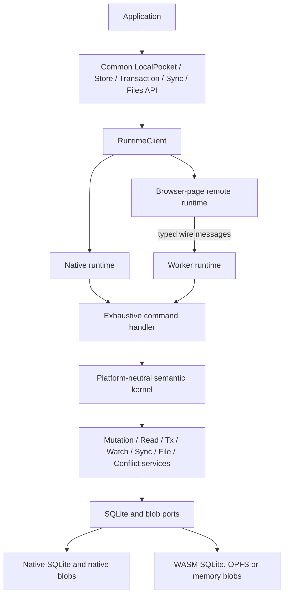

# LocalPocket — Final Refactoring Plan

> **One public API. One semantic kernel. Two small runtimes. One typed command contract.**
>
> This is the final destination and the implementation plan for getting there. It is intentionally radical about names and boundaries, but conservative about behavior: proven storage, query, durability, migration, synchronization, conflict, and file behavior is moved behind better boundaries rather than rewritten for appearance.

---

## 1. The result we are aiming for

A new application should need to understand only these ideas:

- `LocalPocket` — the database handle;
- `Store<S>` — a typed handle for one store definition;
- `StoreDef<S>` and its field descriptors — the schema and type information;
- `Row<S>` — an immutable typed snapshot;
- `QuerySpec<S>` and `SearchSpec<S>` — immutable read requests;
- `Page<S>` and `Cursor<S>` — complete, opaque pagination results;
- `Transaction` — one transaction type on every platform;
- `PocketBaseSync` — one synchronization host;
- `Files<S>` and `StoreConflicts<S>` — typed file and conflict services;
- typed errors, statuses, reports, and capabilities.

There must be:

- one supported import: `package:localpocket/localpocket.dart`;
- one public `LocalPocket` class;
- one public `Store<S>` class;
- one public row, page, search, transaction, files, conflicts, and sync vocabulary;
- one semantic implementation for storage, mutation, queries, cursors, watchers, synchronization, merging, and file metadata;
- one direct runtime for native platforms;
- one remote runtime for the browser page;
- one worker that runs the same semantic kernel as native;
- no SQL, query plans, sync state machines, or database semantics on the browser page;
- compile-time pressure and runtime conformance tests that make native/web drift difficult to introduce;
- no silent loss of schema behavior, events, status fields, pagination facts, or file data.

The important distinction is:

> The platform boundary belongs above database semantics and below the public API. Native calls the kernel directly. Web sends typed commands to a worker that calls the same kernel. The worker is not a dumb SQL server, and the browser page is not a second database engine.

---

## 2. Rules that are not negotiable

These rules are the architecture. A convenient local change that breaks one of them is not a harmless cleanup; it is a design regression.

### Rule 1 — The typed API is the API

Raw map records, raw query builders, raw SQL, raw schema objects, and platform-specific database classes become internal implementation details.

Maps remain valid inside places that naturally need them:

- canonical JSON;
- SQLite row encoding;
- PocketBase request and response bodies;
- persisted synchronization snapshots;
- the final wire codec.

They are not the ordinary application record type. A public CRUD method must not accept or return `Map<String, Object?>`.

Explicit JSON values are allowed where JSON is genuinely the feature. They must be named as JSON/extra data and defensively copied; they must not make the entire record dynamically shaped.

### Rule 2 — The worker runs the kernel

The worker continues to host SQLite WASM, synchronization, migrations, watchers, conflict handling, and blob storage. This is already the repository's strongest web property.

The browser page contains only:

- worker and WASM startup;
- message transport;
- typed request/result/event encoding;
- request and stream bookkeeping;
- browser-only object URL and asset helpers;
- the explicit authentication-token bridge.

It must not contain:

- SQL compilation;
- cursor calculation;
- query result shaping;
- outbox transitions;
- merge logic;
- conflict state changes;
- sync cycles;
- file metadata transitions;
- schema migration decisions.

### Rule 3 — Commands carry meaning, not SQL

Every operation crossing the runtime boundary is a typed command. A command contains validated data such as a store identity, a mutation, a query IR, a transaction session, or a file chunk. It never carries an SQL string or a generic argument map.

The worker validates the command against its manifest and then uses the common compiler and service implementation.

### Rule 4 — No callbacks silently cross a worker

A Dart closure cannot be made worker-safe by putting it inside `toJson()`.

A behavior that must work on native and web must be one of:

1. a built-in serializable data description;
2. a closed strategy implemented by the kernel;
3. an explicit command initiated by the application;
4. rejected before opening the database.

The final common schema does not expose arbitrary validator, resolver, document-migration, or migration-transform callbacks. Unsupported legacy behavior fails with a named `UnsupportedSchemaFeatureError` before any database is considered open.

### Rule 5 — A transaction is an execution context

A transaction is not another kind of collection and not a boolean `inTx` flag.

Every operation that can run inside a transaction receives one explicit internal `ExecutionContext`. A store obtained from a transaction permanently carries that context. The outer database executor can never be selected by an accidental fallback.

### Rule 6 — The kernel shapes results

The kernel owns:

- SQL compilation;
- projection decoding;
- keyset pagination;
- cursor minting and validation;
- `hasNext` and `hasPrev`;
- search result shaping;
- watcher snapshot comparison.

The page does not reconstruct a partial page response into a page object.

### Rule 7 — Events are committed facts

A change event is created and published only after the transaction that caused it has committed. Savepoint rollback, transaction failure, and worker failure cannot leak a change event.

One internal `CommittedChange` envelope feeds query invalidation, record hooks, conflict hooks, and the web event stream. One private omitted-value sentinel is used everywhere.

### Rule 8 — Capabilities describe reality

Native and web expose the same capability model. The values may differ because the physical platforms differ. An unavailable capability produces the same typed error on both platforms.

The browser page never guesses what the worker can do. The worker's open handshake is authoritative for web capabilities.

### Rule 9 — No code generation in this refactor

Do not add `build_runner`, `source_gen`, model generators, or protocol generators. The repository deliberately removed that dependency class because it conflicts with the current analyzer/test/native-assets setup.

Use sealed types, typed value objects, exhaustive switches, direct tests, and small internal codecs instead.

### Rule 10 — Preserve behavior before improving behavior

The current implementation contains hard-earned behavior around:

- WAL and durability;
- group commits;
- savepoints;
- prepared statements and query caching;
- nullable and mixed-direction keyset cursors;
- FTS normalization;
- field encryption;
- outbox and sync-row atomicity;
- watermarks and anti-entropy;
- OCC and retries;
- conflict policies;
- migration recovery;
- content-addressed blobs;
- PocketBase quirks.

The first version of the new architecture must call or move that code. It must not replace it with a cleaner-looking approximation.

---

## 3. What the current repository actually contains

The repository already has a good semantic core. The main problem is that the same surface is described several times.

### 3.1 Current public shape

`lib/localpocket.dart` currently combines:

- the raw map API from `src/core`;
- the typed API from `typed.dart`;
- sync and file exports from `sync.dart`;
- PocketBase transport exports from `pocketbase.dart`;
- a conditional export that selects a native `LocalPocket` or a web `LocalPocket`.

That means the public name `LocalPocket` does not mean exactly the same class on every target.

### 3.2 Current native shape

`src/core/local_pocket.dart` is an orchestration hub. It knows about the SQLite connection, schemas, write queue, group commit, point-read cache, change bus, sync state, conflicts, files, and typed registration.

`src/core/store.dart` combines several responsibilities in one raw store path:

- field validation;
- physical row mutation;
- canonical payload construction;
- sync-row updates;
- outbox updates;
- file dependency behavior;
- cache invalidation;
- change event creation.

The code works, but the ownership boundary is too broad.

### 3.3 Current typed shape

The typed layer is valuable. `StoreDef`, `FieldDef`, `Cond`, `OrderTerm`, `Write`, owner checks, and the compile-fail corpus provide real type safety.

The problem is the lowering path:

```text
TypedCollection
    -> TypedStoreSurface / TypedQuerySurface / TypedSearchSurface
    -> raw Collection / QueryBuilder / SearchBuilder
    -> native database or web-specific mirror
```

The surfaces are map-shaped and implemented separately for native, web, and web transactions. They are duplication seams rather than useful domain boundaries.

### 3.4 Current web shape

The web page currently has a large facade and many mirror classes. The worker has a string operation registry, argument validation, handler parts, session state, file upload state, watcher state, and sync state.

The worker already opens the real core engine. Therefore the main web problem is not a second storage engine; it is a manually maintained remote copy of the public method surface.

The current web stack also contains a compiled-plan transport. It sends SQL-oriented compiler artifacts and then reconstructs page facts such as cursors and page navigation. That is the wrong long-term boundary.

### 3.5 Current synchronization and file shape

The synchronization algorithms are already substantial and well tested. They include pull-before-push ordering, watermarks, rewind handling, sweeps, outbox coalescing, OCC retries, conflict rows, missing-remote policies, auth parking, lifecycle generation guards, and the shared remote-application lane.

The file implementation already handles content addressing, deduplication, refcounts, upload dependencies, temporary files, quotas, TTLs, and volatile web fallback.

These systems should be placed behind ports and the common runtime. They should not be rewritten merely to obtain new class names.

---

## 4. Problems to characterize and close before the final cutover

At the beginning of the work, verify each item against the current checkout. Some may already have a regression test or fix; keep that test and do not redo the behavior unnecessarily.

1. **Schema transport can be lossy.** Current schema JSON does not represent every executable callback or policy. A fingerprint made from incomplete JSON cannot prove equivalent behavior.
2. **Native transaction reads can leak.** Query and search builders created from a transaction must not execute through the outer database executor.
3. **There are two public `LocalPocket` classes.** The public type must become one common facade.
4. **Coarse and detailed change feeds are not identical.** The web side must transport the same committed change facts used by native invalidation.
5. **Projection metadata can be dropped.** The old compiled-plan path sends `decodeColumns`, but every plan field must survive if that bridge exists during migration. The final IR should derive projection decoding inside the kernel.
6. **Ordered watch snapshots must remain ordered.** Explicit query ordering must result in order-sensitive digesting on every runtime.
7. **Web file shapes differ from native shapes.** Both sides must return the same immutable `FileRef` and use the same bounded streaming contract.
8. **Generic file code must not know PocketBase field names.** `imgs`, `imgs+`, and `imgs-` belong in the PocketBase adapter.
9. **Reports must be complete.** `blocked`, `discarded`, quarantine/conflict counters, timestamps, and error state must not disappear in a wire codec.
10. **Realtime ownership must be consistent.** `start()` owns realtime on native and web; there is no public `startRealtime()` method with a web no-op.
11. **Capabilities must come from the active runtime.** A failed probe cannot be replaced by a guessed page-side snapshot.
12. **Retry behavior must have one primitive.** Sync delay and realtime reconnect backoff should share one overflow-safe implementation or clearly composed policies.
13. **There must be one omitted-value sentinel.** Record events and change-bus filters must not interpret different sentinel objects as the same concept.
14. **The public API must not expose constructible `QueryPlan`, raw SQL, or raw point reads.** Internal SQL tests can remain internal.
15. **Sync and file services must stop depending on the concrete public database facade.** They should depend on narrow ports or a kernel context.
16. **Same-version schema changes must be explicit.** The final policy is to reject a behavior-affecting manifest change without a version bump rather than silently leave stale physical columns.
17. **Store identity must be unambiguous.** Duplicate store names and different definition instances for the same registered store are rejected before opening.

Each item gets a named test and a named owner in the migration ledger. A checklist without a test is not considered closed.

---

## 5. Destination architecture



### 5.1 Public API layer

Common Dart code only. It contains the public facade and typed value objects. It imports no `dart:io`, `dart:js_interop`, `package:web`, or SQLite implementation.

### 5.2 Runtime layer

`RuntimeClient` is an internal interface. It has two implementations:

- `LocalRuntimeClient` calls the kernel handler directly;
- `RemoteRuntimeClient` encodes a request, sends it to the worker, and decodes the named result or event.

The public classes do not know which implementation they received.

### 5.3 Semantic kernel

The kernel owns all meaning:

- store registration and manifest validation;
- mutation and transaction rules;
- query compilation and result shaping;
- watchers and committed events;
- sync and conflict state machines;
- file metadata and blob operations;
- maintenance;
- capability reporting.

The kernel uses narrow ports for storage and backend work. It does not depend on the public `LocalPocket` facade.

### 5.4 Platform files

Platform code is limited to real platform concerns:

- opening native SQLite;
- opening WASM SQLite in a worker;
- native file access;
- OPFS and memory blob stores;
- browser worker startup;
- asset resolution;
- native backup file hooks;
- browser object URLs.

The exact number of conditional imports is not the architectural goal. The important rule is that conditional imports choose implementations, never public semantic classes.

---

## 6. The final public API

The following is the intended shape. It is a contract to implement, not a demand to copy every declaration literally.

### 6.1 Opening the database

Use one options object so the signature does not grow a new platform-specific argument every time a feature is added.

```dart
final db = await LocalPocket.open(
  LocalPocketOptions(
    path: 'app.db',
    stores: [Tasks.store, Notes.store],
    encryption: EncryptionConfig.aesGcm256(key: key),
    bootstrap: const BootstrapOptions(
      workerAssetPath: null,
      wasmAssetPath: null,
      requestTimeout: Duration(seconds: 30),
    ),
  ),
);

final tasks = db.store(Tasks.store);
await tasks.put([
  Tasks.title.set('Ship it'),
  Tasks.done.set(false),
]);
```

The actual public declarations should be close to:

```dart
final class LocalPocketOptions {
  const LocalPocketOptions({
    required this.path,
    required this.stores,
    this.encryption,
    this.bootstrap = const BootstrapOptions(),
    this.maxDocumentBytes = 1900000,
  });

  final String path;
  final List<StoreDef<Object?>> stores;
  final EncryptionConfig? encryption;
  final BootstrapOptions bootstrap;
  final int maxDocumentBytes;
}

final class LocalPocket {
  LocalPocket._(this._runtime, this._registry, this.capabilities);

  final RuntimeClient _runtime; // private implementation detail
  final StoreRegistry _registry; // private implementation detail
  final CapabilitiesSnapshot capabilities;

  static Future<LocalPocket> open(LocalPocketOptions options) async {
    final runtime = await openRuntime(options); // private conditional factory
    final result = await runtime.send(
      OpenRequest(
        manifest: compileManifest(options.stores),
        options: encodeRuntimeOptions(options),
      ),
    );
    return LocalPocket._(
      runtime,
      StoreRegistry(options.stores),
      result.capabilities,
    );
  }

  Store<S> store<S extends StoreDef<S>>(S definition) =>
      _registry.store(this, definition);

  Future<T> transaction<T>(
    Future<T> Function(Transaction tx) body, {
    DurabilityClass durability = DurabilityClass.normal,
    bool readOnly = false,
  });

  Future<T> read<T>(Future<T> Function(Transaction tx) body);

  PocketBaseSync attachPocketBaseSync(PocketBaseSyncOptions options);

  Stream<DatabaseChange> get changes;
  Future<void> close();
}
```

There is no abstract public `LocalPocket` with a static `open` method. Static methods do not participate in Dart interface implementation, so the public database type is one concrete class with a private constructor.

`BootstrapOptions` is deployment configuration. It does not contain database semantics and does not create a second web API.

### 6.2 Store definitions

Keep the descriptor design because it gives useful compile-time guarantees without code generation.

```dart
final class Tasks extends StoreDef<Tasks> {
  Tasks._() : super(name: 'tasks', version: 1);
  static final Tasks store = Tasks._();

  static final title = store.schema.text('title').req();
  static final done = store.schema.boolean('done');
  static final priority = store.schema.integer('priority');
  static final dueAt = store.schema.dateTime('due_at');

  @override
  List<FieldDef<Tasks, Object?>> get fields =>
      [title, done, priority, dueAt];

  @override
  List<IndexSpec> get indexes => [
        store.indexSpec([done, priority]),
      ];

  @override
  FtsSpec? get fts => store.ftsSpec([title]);

  @override
  ValidatorSpec get validator => const ValidatorSpec.rules([
        ValidatorRule.nonEmpty('title'),
      ]);

  @override
  ConflictPolicySpec get conflictPolicy =>
      const ConflictPolicySpec.remoteWins();

  @override
  List<MigrationSpec> get migrations => const [];
}
```

The final `StoreDef` remains the only application schema source. Its definition compiles once at open into:

1. `RuntimeSchema` — private executable metadata;
2. `SchemaManifest` — immutable, versioned, wire-safe metadata;
3. the persisted schema definition and fingerprint.

The application does not separately register a `CollectionSchema` and then ask a typed definition to verify it. That two-registration problem disappears.

### 6.3 CRUD and rows

```dart
final tasks = db.store(Tasks.store);

final created = await tasks.put([
  Tasks.title.set('Ship it'),
  Tasks.done.set(false),
  Tasks.priority.set(3),
]);

final row = await tasks.get(id);
final rows = await tasks.getAll([id, anotherId, id]);

await tasks.upsert([
  Writes.id(id),
  Tasks.priority.set(4),
]);

await tasks.patch(id, [Tasks.done.set(true)]);
await tasks.patchAll({
  id: [Tasks.done.set(true)],
  anotherId: [Tasks.priority.set(1)],
});

await tasks.archive(id);
await tasks.restore(id);
await tasks.purge(id);
```

The exact return value of `put` may remain `Future<void>` if that preserves the current contract; the important rule is that all writes accept `Write<S>` values and no public method accepts a whole record map.

`Row<S>` is an immutable snapshot:

```dart
final row = await tasks.get(id);
if (row != null) {
  final String title = row(Tasks.title);
  final bool? done = row(Tasks.done);
  print(row.id);
  print(row.extra); // defensive immutable JSON snapshot
}
```

A row must:

- copy or freeze nested logical values at construction;
- keep descriptor owner checks;
- expose `id` and `archived` as read-only system properties;
- throw `FieldNotSelectedError` for a projected-out field;
- throw package-owned decode/validation errors for corrupt data;
- never implement `Map`;
- return a defensive snapshot from any diagnostic JSON method.

### 6.4 One query specification

There is one immutable query value, not a raw builder and a typed builder with different rules.

```dart
final page = await tasks.query(
  QuerySpec<Tasks>(
    where: [
      Tasks.done.eq(false),
      (Tasks.priority.gte(2) & Tasks.title.startsWith('Ship')) |
          Tasks.title.eq('Draft'),
    ],
    orderBy: [Tasks.priority.desc, Tasks.id.asc],
    select: [Tasks.title, Tasks.priority],
    limit: 20,
  ),
);

final next = await page.next();
final previous = await page.prev();

final count = await tasks.count(
  QuerySpec<Tasks>(
    where: [Tasks.done.eq(false)],
    limit: Limits.unbounded,
  ),
);
```

The public query methods are:

```text
query, count, countDistinct, distinct, ids,
sum, min, max, avg, search, watch, explain/diagnostics
```

They use the same predicate, scope, order, projection, limit, and cursor rules. A count may ignore fields that do not apply to its terminal, but it does not use a second query language.

`QuerySpec` must be defensively immutable. Its values are lowered to an internal `QueryIR` containing:

- manifest/store identity;
- IR and compiler versions;
- validated predicate nodes and encoded values;
- order terms and tie-break information;
- projection field identifiers;
- archived/hidden scope flags;
- limit and direction;
- opaque cursor payload where applicable;
- terminal kind.

No SQL crosses the runtime boundary.

### 6.5 Pages and cursors

```dart
final class Page<S extends StoreDef<S>> {
  final List<Row<S>> items;
  final bool hasNext;
  final bool hasPrev;
  final Cursor<S>? nextCursor;
  final Cursor<S>? prevCursor;

  Future<Page<S>?> next();
  Future<Page<S>?> prev();
}
```

`Cursor<S>` is opaque to application code. It may be persisted as a string, but its internal tuple is not public.

A cursor includes enough information to reject reuse with a different:

- store;
- manifest fingerprint;
- predicate shape and encoded values;
- order and direction;
- projection;
- scope;
- IR/compiler version.

The shared result shaper owns `hasNext`, `hasPrev`, forward paging, backward paging, and cursor creation. This preserves the current nullable-sort, mixed-direction, implicit-tie-breaker, maximum-tuple, and empty-page behavior in one place.

### 6.6 Search

```dart
final hits = await tasks.search(
  SearchSpec<Tasks>(
    term: 'ship',
    limit: 20,
    includeArchived: false,
  ),
);

for (final hit in hits) {
  final task = await hit.fetch();
}
```

Search validation, FTS availability, normalization, fuzzy rules, ranking, and malformed-term behavior remain in the shared search compiler.

### 6.7 Transactions

```dart
await db.transaction((tx) async {
  final taskStore = tx.store(Tasks.store);
  final auditStore = tx.store(AuditEntries.store);

  await taskStore.put([
    Tasks.title.set('Created inside a transaction'),
  ]);

  final page = await taskStore.query(
    QuerySpec<Tasks>(
      where: [Tasks.done.eq(false)],
      limit: 10,
    ),
  );

  await auditStore.put([
    AuditEntries.action.set('task-created'),
    AuditEntries.targetId.set(page.items.single.id),
  ]);
});
```

The public type is always `Transaction`. There is no `Tx`, `WebTx`, or native transaction collection.

The implementation must preserve:

- transaction reads using the transaction executor;
- read-only transactions;
- nested transactions as savepoints;
- group commit and durability behavior;
- commit/rollback completion timing;
- post-commit event ordering;
- worker session cleanup when a callback throws;
- worker close/timeout behavior while a session is active.

Watches are rejected inside transactions with the same typed error on both runtimes unless a complete cross-runtime design is intentionally added later.

### 6.8 Events and watches

```dart
final subscription = tasks.watch(
  QuerySpec<Tasks>(
    where: [Tasks.done.eq(false)],
    orderBy: [Tasks.priority.desc],
    limit: 50,
  ),
).listen((page) {
  // page is already shaped by the kernel
});

final recordSubscription = tasks.events.listen((event) {
  final oldRow = event.oldRecord;
  final newRow = event.newRecord;
});

final databaseSubscription = db.changes.listen((change) {
  print(change.storeName);
  print(change.revision);
});
```

The public API may expose convenience filters such as `onLocal`, `onRemote`, `onResolution`, and field-specific change streams, but they all derive from one internal committed event.

### 6.9 Sync

```dart
final sync = db.attachPocketBaseSync(
  PocketBaseSyncOptions(
    baseUrl: Uri.parse('https://pb.example.com'),
    tokenProvider: tokenProvider,
    identity: 'account-42',
  ),
);

await sync.start(); // starts synchronization and realtime
final report = await sync.syncNow();
await sync.pause();
await sync.resume();
await sync.stop();

sync.status.listen(print);
sync.authRequired.listen((_) async {
  await sync.updateAuth(await tokenProvider.currentToken());
});
```

`start()` owns realtime everywhere. `startRealtime()` is not part of the final public API.

On web, the token provider stays on the page. The worker sends an `AuthRequired` event, and the page sends a short-lived token through a dedicated typed authentication command. Tokens are never written to SQLite, manifests, outbox rows, logs, or debug output.

### 6.10 Files and conflicts

Record-facing file operations are store-scoped:

```dart
final files = tasks.files;

final ref = await files.attach(
  recordId: id,
  field: 'attachment',
  source: FileSource.stream(
    chunks,
    length: knownLength,
    name: 'report.pdf',
  ),
);

final refs = await files.list(id, field: 'attachment');
final stream = await files.open(ref);
await files.remove(ref);
```

The same immutable `FileRef` and `FileSource` types are used on native and web. Downloads and uploads use bounded chunks and flow control. The browser page must not receive a whole file merely because the current facade happens to buffer it.

Conflict operations are typed:

```dart
final conflicts = tasks.conflicts;
final open = await conflicts.listOpen();

await conflicts.resolve(
  conflictId,
  merged: [
    Tasks.title.set('Chosen by the user'),
    Tasks.done.set(true),
  ],
);

await conflicts.acceptLocal(conflictId);
await conflicts.acceptRemote(conflictId);
```

Automatic built-in policies are manifest data. A custom application decision is an explicit resolution command. It is not a closure hidden inside a worker schema.

### 6.11 Maintenance and capabilities

The ordinary API can expose typed operations such as:

```text
capabilities
flush
analyze(StoreDef)
compact(StoreDef, ...)
pruneOutbox(...)
walCheckpoint()
vacuum()
backup()
```

It must not expose `Database`, `DatabaseExecutor`, `execute`, `rawQuery`, raw table names, or a public `QueryPlan` constructor.

---

## 7. The internal typed command contract

The runtime contract is internal, but it is the most important parity mechanism.

### 7.1 Request, result, and event families

Use sealed types with stable, explicit wire tags.

```dart
// contract.dart
library;

part 'request_store.dart';
part 'request_transaction.dart';
part 'request_files.dart';
part 'request_sync.dart';
part 'request_maintenance.dart';
part 'result_store.dart';
part 'result_transaction.dart';
part 'result_files.dart';
part 'result_sync.dart';
part 'event.dart';

sealed class Request<R extends Result> {
  const Request();
}

sealed class Result {
  const Result();
}

sealed class Event {
  const Event();
}

final class GetRequest extends Request<GetResult> {
  const GetRequest({
    required this.store,
    required this.id,
    this.select,
    this.context,
  });

  final StoreName store;
  final String id;
  final SelectMask? select;
  final ExecutionContextId? context;
}

final class QueryRequest extends Request<QueryPageResult> {
  const QueryRequest({
    required this.store,
    required this.ir,
    this.context,
  });

  final StoreName store;
  final QueryIR ir;
  final ExecutionContextId? context;
}

final class MutateRequest extends Request<MutationResult> {
  const MutateRequest({
    required this.store,
    required this.mutation,
    this.context,
  });

  final StoreName store;
  final Mutation mutation;
  final ExecutionContextId? context;
}

final class BeginTransactionRequest extends Request<BeginTransactionResult> {
  const BeginTransactionRequest({
    required this.readOnly,
    required this.durability,
  });

  final bool readOnly;
  final DurabilityClass durability;
}

final class CommitTransactionRequest extends Request<CommitResult> {
  const CommitTransactionRequest(this.context);
  final ExecutionContextId context;
}

final class CloseRequest extends Request<CloseResult> {
  const CloseRequest();
}

final class CommittedChange extends Event {
  const CommittedChange({
    required this.revision,
    required this.store,
    required this.changes,
    required this.origin,
  });

  final int revision;
  final StoreName store;
  final List<ChangeRecord> changes;
  final ChangeOrigin origin;
}
```

The real contract includes the complete operation inventory: lifecycle, CRUD, queries, search, transaction/savepoint, watches, maintenance, capabilities, files, conflicts, sync, authentication, and close.

Every request has:

- a stable tag independent of Dart class names or minification;
- typed fields rather than an `args` map;
- a named result type;
- a clear context/session rule;
- one service owner.

Every result is named. Errors are thrown through one typed error codec rather than represented as an untyped result map.

### 7.2 Exhaustive handling

```dart
final class CommandHandler {
  CommandHandler(this.kernel);

  final Kernel kernel;

  Future<Result> handle(Request request) => switch (request) {
        GetRequest value => kernel.read.get(value),
        QueryRequest value => kernel.read.query(value),
        MutateRequest value => kernel.mutations.mutate(value),
        BeginTransactionRequest value => kernel.transactions.begin(value),
        CommitTransactionRequest value => kernel.transactions.commit(value),
        CloseRequest value => kernel.close(value),
        // every remaining request family is listed explicitly
      };
}
```

There is no wildcard branch. If a new request is added to the sealed library, this switch fails to compile until it is handled.

The command files are `part` files of one contract library. That is deliberate: Dart's sealed-class exhaustiveness is strongest when all direct subtypes are visible in the same library. Do not scatter direct sealed subtypes across unrelated libraries and assume the analyzer can enforce the same guarantee.

### 7.3 Native and remote runtimes

```dart
abstract interface class RuntimeClient {
  Future<R> send<R extends Result>(Request<R> request);
  Stream<Event> get events;
  Future<void> close();
}

final class LocalRuntimeClient implements RuntimeClient {
  LocalRuntimeClient(this.handler);
  final CommandHandler handler;

  @override
  Future<R> send<R extends Result>(Request<R> request) async {
    final result = await handler.handle(request);
    return checkExpectedResult<R>(request, result);
  }

  @override
  Stream<Event> get events => handler.kernel.events;

  @override
  Future<void> close() => handler.kernel.closeRuntime();
}

final class RemoteRuntimeClient implements RuntimeClient {
  RemoteRuntimeClient(this.transport);
  final WireTransport transport;

  @override
  Future<R> send<R extends Result>(Request<R> request) async {
    final response = await transport.send(WireCodec.encodeRequest(request));
    return WireCodec.decodeResult(request, response);
  }

  @override
  Stream<Event> get events => transport.events.map(WireCodec.decodeEvent);

  @override
  Future<void> close() => transport.close();
}
```

The snippets show the shape. If Dart's generic inference needs a small internal helper, use a typed helper that checks the expected result variant. Do not fall back to `dynamic`, `Object?`, or a generic result map.

Native does not serialize requests. It passes typed objects directly to the handler. The remote runtime serializes only because a worker boundary requires it.

### 7.4 Wire messages

The wire envelope is small and generic; the payload is defined by the typed contract.

```text
Request message:
  protocolVersion
  requestId
  sessionId, when applicable
  requestTag
  typed payload

Success response:
  protocolVersion
  requestId
  resultTag
  typed payload

Error response:
  protocolVersion
  requestId
  errorTag
  message
  typed details

Event message:
  protocolVersion
  eventSequence
  eventTag
  typed payload
```

The codec rules are:

- request tags are stable literals, not `runtimeType.toString()`;
- every tag is unique;
- each request has exactly one expected result family;
- request IDs and transaction session IDs are validated;
- stale or duplicate replies are rejected or safely ignored according to the request lifecycle;
- unknown protocol versions fail with `ProtocolMismatchError`;
- malformed payloads fail with `ProtocolDecodeError`, never a raw cast exception;
- `Uint8List` chunks use one binary-aware value codec;
- errors map to the same public error classes on native and web;
- events preserve sequence and committed revision information;
- a worker close fails all pending requests and streams with `DatabaseWorkerClosedException`;
- a timeout does not silently respawn a worker or create a second database.

`WireCodec.decodeResult` receives the original request as context. It verifies that the result tag is the result expected for that request, so a valid response for the wrong operation cannot be accepted accidentally.

### 7.5 Codec tests and stable tags

For every request, result, and event:

1. construct a representative value;
2. encode it;
3. decode it;
4. compare every field;
5. execute the decoded request in the VM loopback harness;
6. compare the result and emitted events;
7. test malformed tags, missing fields, wrong types, stale versions, duplicate IDs, and unexpected result tags.

A small contract test reads all stable tags and fails on duplicates. This is necessary because unique string values are not a Dart compile-time property.

---

## 8. The semantic kernel

The kernel is split by responsibility, but it remains one implementation.

### 8.1 Kernel construction

```text
Kernel
  RuntimeSchemaRegistry
  TransactionCoordinator
  MutationService
  ReadService
  SearchService
  WatchService
  ChangePublisher
  SyncService
  ConflictService
  FileService
  MaintenanceService
  CapabilitiesProvider
```

`Kernel` receives platform-neutral ports:

```text
SqliteExecutor
BlobStore
Clock
BackupStore
StorageCapabilities
BackendFactory
```

Native and worker construction supplies different physical implementations of those ports. The services do not branch on platform names.

### 8.2 Mutation ownership

`MutationService` becomes the sole owner of local and remote document mutation semantics.

It preserves:

- generated and explicit IDs;
- required and optional field validation;
- put as create-or-replace;
- upsert as create-or-merge;
- patch as update-only;
- archive, restore, and purge behavior;
- duplicate-write rules;
- canonical payload construction;
- exact UTF-8 byte limits;
- encrypted field encoding;
- dirty-base capture;
- dirty-field union;
- outbox and sync-row atomicity;
- file dependency updates;
- cache invalidation;
- committed event buffering;
- batch probes and targeted update fast paths;
- group-commit behavior.

A local write, a conflict resolution, and an accepted remote record must use the same authoritative validation and row-encoding path wherever their semantics overlap.

### 8.3 Transaction ownership

`TransactionCoordinator` owns:

- the write queue;
- transaction start and settlement;
- durability mode changes;
- group-commit barriers;
- manual savepoints;
- execution-context lifetime;
- event/change buffers;
- post-commit invalidation;
- cleanup after errors and worker close.

The existing manual savepoint implementation remains valid. The final design must retain the repository's `sqflite_common` constraint and its explicit `SAVEPOINT`, `ROLLBACK TO`, and `RELEASE` operations.

The context model looks like this:

```dart
final class ExecutionContext {
  ExecutionContext.root(this.runtimeGeneration)
      : id = const ExecutionContextId.root(),
        executor = null,
        readOnly = false;

  ExecutionContext.transaction({
    required this.id,
    required this.executor,
    required this.readOnly,
    required this.runtimeGeneration,
    required this.parent,
  });

  final ExecutionContextId id;
  final DatabaseExecutor? executor;
  final bool readOnly;
  final int runtimeGeneration;
  final ExecutionContext? parent;
}
```

The real implementation may use private classes, but every service receives the context explicitly. There is no `_exec ?? pocket.db` decision inside individual store methods.

### 8.4 Read ownership

`ReadService` owns:

- scope filters;
- projections;
- field decoding;
- order and tie-break rules;
- cursor validation;
- page results;
- count, IDs, distinct, and aggregates;
- search execution;
- watcher snapshots.

The existing compiler and runner are moved behind this service. They are not rewritten into a new SQL implementation during the API refactor.

### 8.5 Sync ports

Synchronization should depend on narrow contracts such as:

```text
LocalDocumentStore
SyncMetadataStore
TransactionRunner
ChangePublisher
Clock
FileMetadataStore
```

The sync state machine continues to own:

- pull and push ordering;
- cursor and rewind behavior;
- watermarks;
- sweep visibility;
- OCC retries;
- missing-remote policy;
- quarantine and conflict states;
- lifecycle generations;
- auth parking;
- status reporting.

It no longer needs to import the public `LocalPocket` facade merely to reach a table or a change stream.

### 8.6 PocketBase adapter

The PocketBase adapter owns only PocketBase behavior:

- URL and filter syntax;
- fixed-width timestamp formatting and parsing;
- batch response ordering and limits;
- authentication transport;
- SSE handshake and reconnect;
- HTTP error translation;
- `imgs`, `imgs+`, and `imgs-` attachment mapping.

The generic sync and file services know none of those field names or wire quirks.

### 8.7 File ownership

`FileService` depends on a blob port and file metadata port. It does not depend on concrete sync table names.

The existing file invariants remain mandatory:

- lowercase SHA-256 blob keys;
- atomic native publication through temporary files;
- deduplication and refcounts;
- record-before-file operation dependencies;
- removal of pending uploads without orphaning metadata;
- remote-only handling;
- bounded web upload sessions;
- TTL and aggregate quota enforcement;
- honest volatile-storage capability reporting;
- encryption behavior and limits.

---

## 9. Schema manifests and executable behavior

This is a separate deliverable, not a detail to hide inside a new `toJson()` method.

### 9.1 Three schema objects

#### `StoreDef<S>`

The public typed declaration. It owns descriptors, indexes, FTS settings, supported validator rules, conflict policy description, attachment mapping, and migration descriptions.

#### `RuntimeSchema`

Private compiled metadata used by the kernel and storage layer. It may contain prepared field codecs, physical column information, and executable indexes.

#### `SchemaManifest`

Immutable, versioned, serializable data used for worker open, persisted definition checks, and migration decisions.

### 9.2 Manifest contents

The manifest contains every behavior-affecting value:

- manifest format version;
- store name and schema version;
- ordered fields;
- field names and kinds;
- nullability and requiredness;
- enum wire values;
- references and foreign-key policy;
- encryption mode and format;
- indexes and scopes;
- FTS fields, fuzzy setting, and normalization rules;
- archive and file options;
- attachment mappings;
- validator rule descriptors;
- built-in conflict policy descriptors;
- migration operation descriptors;
- query IR/compiler version;
- feature flags that alter behavior.

Its fingerprint is computed from canonical serialized bytes, not from an incomplete legacy object.

Secret keys and access tokens are never put into the persisted manifest. If encryption needs a key identity, the manifest contains a non-secret key identifier or format identity, never key material.

### 9.3 Unsupported behavior

Before DDL, migration, or worker registration:

```text
compile StoreDef
  -> inspect every executable feature
  -> encode supported feature descriptors
  -> reject unsupported callback or option
  -> validate duplicate names and fields
  -> calculate complete fingerprint
  -> open/migrate only after all checks pass
```

An error should identify:

- store name;
- schema version;
- feature name;
- runtime, when useful;
- the reason it cannot be represented.

There is no path that drops a callback and continues with a different schema.

### 9.4 Migrations

The final common migration language is a closed data description, for example:

```text
rename field
remove field
set default
copy field
change enum wire value
apply closed primitive conversion
normalize object/list shape
```

Arbitrary `Map` transforms and Dart closures are not part of the worker-safe schema contract.

Existing destructive migration behavior must be preserved:

- backup creation;
- rebuilding state markers;
- crash recovery;
- stale temporary table cleanup;
- resume-in-place behavior;
- refusal after a completed backup where applicable;
- typed errors for a failed or unsafe migration.

A same-version behavior-affecting manifest change is rejected. The application must increase the store version and provide a valid migration description.

---

## 10. Query IR, pages, cursors, and watchers

### 10.1 Migration bridge

Before deleting the existing compiled-plan path:

1. add round-trip tests for every current plan field, including projection/decode information;
2. verify stale plan, shape, schema, and argument-count rejection;
3. use the existing compiler and runner as the behavior oracle;
4. add a native-vs-worker comparison for representative plans.

This bridge is temporary. It is not the destination.

### 10.2 Final query path

```text
public QuerySpec<S>
  -> common typed lowering and validation
  -> QueryIR
  -> manifest validation
  -> one shared compiler
  -> private CompiledQuery
  -> one shared runner
  -> complete named result
  -> public Row/Page/SearchHit wrappers
```

The page sends `QueryIR`, never `CompiledQuery` or SQL.

The worker validates:

- store and manifest identity;
- field ownership and field existence;
- operator/value compatibility;
- projection fields;
- scope flags;
- limit bounds;
- cursor shape;
- IR version.

### 10.3 Result shaping

The common query result shaper returns all facts needed by the public page:

```dart
final class QueryPageResult extends Result {
  const QueryPageResult({
    required this.rows,
    required this.hasNext,
    required this.hasPrev,
    required this.nextCursor,
    required this.prevCursor,
    required this.projection,
  });

  final List<EncodedRow> rows;
  final bool hasNext;
  final bool hasPrev;
  final CursorToken? nextCursor;
  final CursorToken? prevCursor;
  final SelectMask projection;
}
```

The browser page only decodes rows and wraps them. It does not derive page direction, request another probe, or mint a cursor.

### 10.4 Cursor rules

Preserve and test the existing behavior for:

- forward and backward keyset traversal;
- null sort values;
- mixed ascending and descending terms;
- implicit ID tie-breaking;
- uniform descending order;
- maximum tuple compensation for unordered pages;
- empty terminal pages;
- stale shape and stale schema rejection;
- persisted cursors after reopen.

A cursor is an opaque capability to continue one exact query shape, not a bag of values the application can edit.

### 10.5 Watch rules

A watcher stores the validated query IR in the kernel. On a committed change it:

1. checks whether the change can affect the query;
2. coalesces refreshes using the existing cadence;
3. executes the same read path as a one-shot query;
4. calculates one shared digest;
5. emits only when the snapshot changed.

An explicitly ordered query uses an order-sensitive digest. An unordered query may use canonical order-insensitive comparison. This policy is shared by native and worker runtimes.

---

## 11. Web transport and lifecycle

### 11.1 Worker responsibilities

The worker entry point should become a small generic loop:

```text
receive structured-clone message
  -> validate protocol envelope
  -> decode Request
  -> CommandHandler.handle(request)
  -> encode named Result or typed Error
  -> send response

kernel event
  -> encode Event
  -> send event
```

It may retain separate physical files for readability, but those files must register or route commands rather than interpret business semantics.

### 11.2 Page responsibilities

The page runtime owns:

- request ID allocation;
- response matching;
- timeout handling;
- stream subscriptions and cancellation;
- worker close propagation;
- asset and worker startup;
- browser object URL cleanup;
- token-provider calls after an auth-required event.

It does not own database state transitions.

### 11.3 Transactions over the worker

The smaller migration path is an explicit worker session:

```text
BeginTransaction -> context/session ID
Store command   -> carries context/session ID
Savepoint       -> carries context/session ID
Commit/Rollback -> settles that session
```

The page callback still runs on the page, but the actual SQLite transaction remains open in the worker. If the callback fails, the page sends rollback before rethrowing. If the worker closes, the session and every pending request fail with the common worker-closed error.

A future transaction-program optimization may batch a known sequence of operations, but it is not required for the first final architecture.

### 11.4 File streams over the worker

Ordinary request/response commands handle metadata. File data uses explicit upload/download sessions:

```text
FileBeginUpload -> session ID and accepted limits
FileChunk       -> bounded binary chunk
FileFinish      -> immutable FileRef result
FileAbort       -> cleanup
FileOpen        -> stream ID
FileChunkEvent  -> bounded download chunk
FileCredit      -> page grants more download capacity
FileClose       -> end stream
```

The protocol enforces current per-file, aggregate, chunk-size, concurrency, and TTL limits. It must not accumulate an unbounded file in a single map payload.

### 11.5 Worker crash and timeout rules

- worker crash closes all remote streams;
- pending requests complete with `DatabaseWorkerClosedException`;
- timeout produces `DatabaseWorkerTimeoutException` and does not respawn the worker;
- a caller must explicitly reopen to recover;
- a late response cannot revive a closed runtime;
- reopening never silently creates a replacement database under the same public object.

---

## 12. Implementation sequence

Every phase ends with a green, committed state. Transitional code may exist internally, but it must have an owner, a deletion phase, and no new application-facing API.

### Phase 0 — Freeze reality and build the ledger

**Goal:** establish a factual baseline before changing ownership.

1. Record the current `dart analyze`, hermetic test, release-gate, browser, live-server, coverage, and benchmark results.
2. Record known timing-sensitive flakes separately; do not hide them by weakening gates.
3. Inventory every public symbol from the four current entry points, every raw/typed/web method, every worker operation, every event, every file command, and every sync command.
4. Mark each item `KEEP`, `REPLACE`, `INTERNALIZE`, or `DELETE`.
5. Write the final API compile fixture for VM and JavaScript.
6. Write the final naming table and the manifest/callback policy.
7. Assign every current production file a destination or deletion phase.
8. Freeze feature additions to the old surface.

**Gate:** current repository remains green; inventory and final contract fixture are committed.

### Phase 1 — Characterize and fix boundary defects

**Goal:** do not carry known parity failures into new boundaries.

1. Add the transaction-query regression test before changing transaction code.
2. Add complete plan round-trip coverage while the old plan bridge still exists.
3. Pin ordered watcher digest behavior on native and web.
4. Add coarse/detailed event equivalence tests.
5. Add complete sync status/report codec tests, including `blocked` and all timestamps/counters.
6. Add capability handshake tests where worker failure cannot become a guessed capability.
7. Add one-sentinel tests for omitted change values.
8. Add start/realtime lifecycle tests.
9. Add file shape and stream contract tests.
10. Add manifest callback-loss tests that fail if behavior is silently omitted.

Fix independent defects in small commits. If a defect has already been corrected, preserve the test and record it as complete.

**Gate:** old public architecture is still usable and all characterization tests pass.

### Phase 2 — Free the name and extract the kernel context

**Goal:** make a shared semantic owner possible without changing behavior.

1. Rename the current concrete core database owner to an internal name such as `KernelDatabase`.
2. Introduce an internal `KernelContext` containing the database executor, schemas, clock, capabilities, change publisher, outbox, files, and sync ports.
3. Introduce `ExecutionContext` and route current transaction operations through it.
4. Make native transaction query/search operations use their context.
5. Extract `MutationService` around the existing mutation path without changing SQL or event semantics.
6. Extract `TransactionCoordinator` around the existing write queue, savepoints, durability, and group-commit code.
7. Add `ReadService` as a wrapper around the existing compiler and runner.
8. Make the worker construct the same kernel context as native, using its WASM/OPFS adapters.
9. Keep old raw and typed entry points as internal migration clients only; do not add new features to them.

**Gate:** old tests still pass; direct native and current worker paths reach the same services; the outer-executor fallback is gone.

### Phase 3 — Implement the complete schema manifest

**Goal:** make worker/native schema equivalence meaningful.

1. Change `StoreDef` to expose data descriptors rather than arbitrary executable callbacks.
2. Build `RuntimeSchema` and `SchemaManifest` separately.
3. Include every supported behavior-affecting field in the manifest.
4. Implement canonical encoding, version checks, duplicate checks, and full fingerprints.
5. Reject unsupported behavior before DDL/open.
6. Persist the manifest and compare it on reopen.
7. Reject same-version behavior changes.
8. Keep migration backup, resume, and destructive-rebuild behavior unchanged.
9. Test forward-version rejection, malformed manifests, missing fields, unsupported features, and callback non-serialization.
10. Make the worker open handshake receive the manifest and return authoritative capabilities.

**Gate:** native and worker open the same supported manifest; unsupported behavior fails before any schema mutation.

### Phase 4 — Add the sealed contract and loopback runtime

**Goal:** establish the parity boundary before replacing the web facade.

1. Create the single `contract.dart` library with `part` files for all request/result/event families.
2. Give every variant stable tags and typed fields.
3. Create exhaustive encode/decode functions.
4. Create the common error codec.
5. Create `CommandHandler` with an exhaustive request switch.
6. Create `LocalRuntimeClient` and a VM loopback runtime that serializes and decodes the same messages without JavaScript.
7. Make the worker accept the new typed envelope while the old wire remains as a temporary adapter.
8. Test all variants, tags, malformed messages, wrong-result responses, binary values, stale versions, and stream cancellation.

The VM loopback is a crucial safety net: it tests the real page/worker contract without needing a browser for every iteration.

**Gate:** direct native runtime and VM codec loopback execute the same representative commands and emit equal canonical results/events.

### Phase 5 — Build the final public facade as a vertical slice

**Goal:** prove the destination API before migrating every feature.

1. Implement one common concrete `LocalPocket`.
2. Implement one common `Store<S>` over `RuntimeClient`.
3. Implement immutable `Row<S>`.
4. Implement `Transaction` and context-bound store views.
5. Implement the following on native and loopback first:
   - put/get/getAll;
   - patch;
   - projection query;
   - forward/backward page;
   - transaction commit/rollback/savepoint;
   - watch one;
   - one typed validation/decode error.
6. Make the same facade use `RemoteRuntimeClient` on the real browser page.
7. Keep old adapters behind internal names only.
8. Add the final public compile fixture to both VM and JavaScript builds.

**Gate:** the vertical slice works through the direct runtime, VM loopback, and a real browser worker.

### Phase 6 — Replace compiled-plan shipping with Query IR

**Goal:** make the kernel the only owner of SQL and page facts.

1. Finish the temporary compiled-plan bridge tests.
2. Define versioned `QueryIR`, `PredicateIR`, `SearchIR`, and terminal/result variants.
3. Lower the existing typed condition algebra and descriptors into IR.
4. Reuse the existing compiler and runner behind `ReadService`.
5. Add shared result shaping and opaque cursors.
6. Cut over one terminal at a time:
   - page query;
   - count and IDs;
   - distinct and aggregates;
   - explain/diagnostics;
   - search;
   - backward paging;
   - query watches.
7. Add the full cursor corpus to direct and loopback conformance.
8. Delete page-side page reconstruction and cursor minting.
9. Delete public `QueryPlan` construction.

**Gate:** no SQL crosses the new runtime boundary; direct and loopback produce identical page facts and cursor behavior.

### Phase 7 — Cut over command families and collapse the web page

**Goal:** replace the string/map wire without a big-bang rewrite.

For each family, do these steps in order:

1. define request/result/event variants;
2. add the exhaustive handler case;
3. add codec round-trip and malformed-input tests;
4. point the common remote runtime at the new command;
5. run the family conformance and browser smoke tests;
6. delete the old family facade and handler code.

Use this order:

1. CRUD and batch mutation;
2. query/search/cursors;
3. watches and committed events;
4. transactions and savepoints;
5. maintenance and capabilities;
6. conflicts;
7. files and upload/download streams;
8. sync, auth, status, and realtime;
9. close and lifecycle.

During this phase the worker may temporarily understand both old and new envelopes, but both paths must call the same kernel services. The old path is a migration adapter, not a second semantic implementation.

Delete the old web facade, web collection/query/search/transaction mirrors, `WireOp`/`WireArgs` sprawl, plan-shipping files, per-feature worker handler semantics, and platform-specific public classes only after the corresponding family passes.

**Gate:** the page contains transport/bootstrap code only; real browser smoke passes after every family.

### Phase 8 — Finish sync, conflicts, files, and maintenance

**Goal:** bring every meaningful existing capability onto the same public model.

#### Synchronization

1. Implement one common `PocketBaseSync` facade.
2. Make `start()` start both sync and realtime.
3. Keep the actual `SyncEngine` in the kernel on native and in the worker on web.
4. Keep page-side token refresh as an explicit auth bridge.
5. Use one complete `SyncStatus`/`SyncReport` model and codec.
6. Include `blocked`, `discarded`, quarantine/conflict counts, timestamps, and errors wherever the model exposes them.
7. Make the worker's capabilities authoritative.
8. Use one backoff primitive for periodic sync and realtime reconnects.
9. Preserve identity scoping, outbox ordering, pull-before-push, watermarks, anti-entropy, OCC, retry bounds, auth parking, and lifecycle generation behavior.

#### Conflicts

1. Add `StoreConflicts<S>` and immutable typed conflict snapshots.
2. Support list, get, watch, resolve, accept-local, and accept-remote.
3. Keep custom decisions as explicit resolution commands.
4. Ensure resolution uses the common mutation and event path.

#### Files

1. Add common `Files<S>`, `FileRef`, and bounded `FileSource`/stream types.
2. Keep blob storage in platform adapters.
3. Keep metadata and dependency behavior in the kernel file service.
4. Move PocketBase attachment field mapping into the PocketBase adapter.
5. Preserve upload quotas, TTLs, deduplication, refcounts, remote-only state, and volatile-storage reporting.

#### Maintenance

1. Add typed maintenance commands and named results.
2. Keep raw SQL and database adapters internal.
3. Make unavailable physical operations return the common capability error or documented no-op result consistently.

**Gate:** sync, conflict, file, and maintenance conformance passes through direct, loopback, and real browser runtimes.

### Phase 9 — Migrate tests and switch the public barrel

**Goal:** make the final API the only application API.

1. Move public behavior tests to `Store`, `Row`, `Page`, `QuerySpec`, `Transaction`, sync, files, and conflicts.
2. Use a pair-and-keep rule for overlapping raw and typed tests: retain the stronger assertion set and port its intent once.
3. Keep storage, migration, codec, merge, PocketBase, and blob unit tests internal where that gives better coverage.
4. Formalize the two-executor harness so public behavior tests run against:
   - direct local runtime;
   - VM codec loopback.
5. Keep Chromium, Firefox, and WebKit tests for browser-only behavior.
6. Port benchmarks to the final public API while retaining raw maps only inside competitor harnesses or internal fixtures.
7. Switch `lib/localpocket.dart` to the final curated exports.
8. Remove public raw schema, database, query, page, transaction, sync-engine, PocketBase-client, and file implementation exports.
9. Delete the three auxiliary application barrels.
10. Remove temporary migration aliases and legacy adapters from exported code.

**Gate:** the public surface gate passes; no application test imports a deleted public type; direct and loopback suites are green.

### Phase 10 — Move files and delete the old architecture

**Goal:** make the source tree tell the truth after the design is stable.

1. Move typed code into `api`/`schema` ownership.
2. Move semantic core code into `kernel` ownership.
3. Move browser code into `platform/web` and runtime transport ownership.
4. Move native implementation code into `platform/native`.
5. Keep PocketBase adapter code separate from generic storage and file services.
6. Delete, where no longer referenced:
   - `lib/typed.dart`;
   - `lib/sync.dart`;
   - `lib/pocketbase.dart`;
   - raw public `Collection`, `Page`, `Tx`, query/search builders, and schema exports;
   - typed map surfaces and their adapters;
   - conditional public `LocalPocket` implementations;
   - web facade and semantic proxy directories;
   - compiled-plan transport and page-side result reconstruction;
   - string operation registries and per-operation map validators;
   - platform sync host duplicates;
   - public raw file/conflict forms;
   - `verifyRegisteredSchema` and the second schema-registration path.
7. Use move-only commits where possible after behavior has settled.

**Gate:** no deleted symbol is exported or referenced by ordinary application fixtures; dependency and layering checks pass.

### Phase 11 — Harden and prepare the release

**Goal:** prove the architecture is difficult to break, not merely that it compiles today.

1. Run the complete release runner from a clean checkout.
2. Run every public conformance case against direct and loopback runtimes.
3. Run Chromium, Firefox, and WebKit web and sync matrices.
4. Run live PocketBase scenarios, including the complete wire test set rather than only a subset of live folders.
5. Test worker close, timeout, malformed messages, stale cursor, stale manifest, unsupported schema behavior, and restart recovery.
6. Test transaction close/error races and savepoint event rollback.
7. Test OPFS absence, volatile fallback, file quotas, chunk limits, and object URL cleanup.
8. Test corrupt persisted rows, corrupt manifests, malformed remote records, and encryption failures.
9. Rebuild the checked-in worker asset and its hash. The release gate must verify the actual shipped asset, not only a file in `build/`.
10. Rebaseline coverage only after deletions, retaining the existing critical thresholds.
11. Compare write, point-read, keyset, projection, watch, sync-apply, and file benchmarks against the recorded baseline.
12. Review every public export manually.
13. Tag the completed architecture only after all gates pass.

---

## 13. Test strategy

The test suite should prove both semantics and boundaries without forcing every SQL implementation detail through the public API.

### 13.1 Kernel tests

Keep focused internal tests for:

- schema compilation and DDL;
- migrations and destructive recovery;
- physical row codecs;
- canonical JSON, hashing, IDs, and encryption;
- query compiler and cursor corpus;
- mutation fast paths;
- durability, write queue, group commit, and savepoints;
- outbox, sync rows, op queue, and file metadata;
- merge policies and conflict state;
- PocketBase filter, timestamp, batch, and SSE quirks;
- blob stores and atomic publication.

These tests may import `src/` internals. They should not be weakened simply to make the public API more abstract.

### 13.2 Public conformance tests

Create one suite parameterized by a runtime factory:

```dart
void runStoreConformance(
  String name,
  Future<LocalPocket> Function() open,
) {
  group(name, () {
    test('CRUD and batch behavior', () async { /* same body */ });
    test('projection and immutable rows', () async { /* same body */ });
    test('forward and backward cursors', () async { /* same body */ });
    test('transactions and savepoints', () async { /* same body */ });
    test('ordered watcher dedupe', () async { /* same body */ });
  });
}
```

Run the same body against:

1. native direct runtime;
2. VM codec loopback runtime;
3. real browser worker where browser behavior matters.

Cover every public capability, not just CRUD:

- all field kinds and nullability;
- enums and wire values;
- JSON and extra snapshots;
- encryption;
- every condition/operator and boolean composition;
- projections and corrupt values;
- all cursor directions and stale-cursor cases;
- aggregates, distinct, IDs, and search;
- archive, restore, purge, and hidden rows;
- read-only and nested transactions;
- post-commit events and rollback suppression;
- conflicts and explicit resolutions;
- file attachment, streaming, removal, and durability;
- sync lifecycle, auth, status, reports, retries, and realtime.

### 13.3 Contract tests

Test every request/result/event variant for:

- round-trip equality;
- unique stable tags;
- malformed payload rejection;
- version mismatch;
- wrong result for request;
- unknown event handling;
- binary chunks;
- late reply after timeout;
- close while pending;
- stream cancellation;
- transaction session mismatch.

### 13.4 Compile-fail tests

Extend the existing compile-fail corpus to assert:

- a field from another store cannot be used;
- a condition from another store cannot be used;
- a write from another store cannot be used;
- required fields reject null;
- `id` and `archived` cannot be written;
- projected-out fields cannot be read;
- raw map writes are not part of the public API;
- a web/native-specific semantic class is not required by the fixture;
- a malformed model cannot bypass the descriptor owner checks through ordinary APIs.

### 13.5 Differential and fault tests

Seed equivalent stores in native and loopback runtimes, apply the same operations, and compare canonical:

- rows;
- page facts;
- cursors as opaque tokens plus their acceptance/rejection behavior;
- events;
- sync statuses and reports;
- conflict state;
- file metadata.

Add deterministic fault injection for:

- failed commit;
- failed rollback;
- worker timeout;
- worker close;
- malformed remote page;
- duplicate response;
- out-of-order response;
- failed file chunk;
- failed migration backfill;
- OCC conflict;
- transient/auth/forbidden/not-found backend errors.

### 13.6 Browser tests

Retain the real browser matrix for:

- worker and WASM startup;
- structured-clone values;
- OPFS and memory fallback;
- binary chunk transport;
- object URLs;
- transaction session lifetime;
- close and timeout handling;
- crypto worker behavior;
- sync HTTP/SSE/auth;
- real capability handshake.

A VM loopback is necessary but does not replace browser testing.

---

## 14. Gates that must be improved

The current repository already has release, API snapshot, raw API, typed-surface, layering, web, browser, coverage, asset, documentation, and dependency checks. Keep them, but change what they prove.

### 14.1 Public API gate

The current snapshot is primarily an export-line snapshot. Replace or augment it with an analyzer-based public element inventory that checks:

- exactly one supported application barrel;
- exactly one public `LocalPocket` class;
- no public raw `Collection`, raw `Page`, raw `Tx`, `QueryBuilder`, `SearchBuilder`, `QueryPlan`, `CollectionSchema`, `Database`, or `DatabaseExecutor`;
- no ordinary CRUD signature containing `Map<String, Object?>`;
- no ordinary public semantic type prefixed with `Typed`, `Raw`, `Web`, or `Native`;
- no platform imports in API, schema, contract, kernel, query, sync, or generic file layers;
- public rows/pages/results are immutable or defensively copied;
- no conditional export selecting different public semantic classes.

Keep a checked-in golden surface so intentional API changes are reviewed.

### 14.2 Contract gate

Add checks for:

- every sealed request/result/event direct subtype is part of the contract library;
- every stable tag is unique;
- every request is handled by the kernel switch;
- every request/result/event is encoded and decoded;
- no wildcard/default hides a new variant;
- error codes map to a known common error type;
- no command contains a generic `args` map.

The analyzer catches missing exhaustive cases. The gate catches tag and registration mistakes that the type system cannot catch.

### 14.3 Layering gate

Enforce:

```text
api/schema/contract -> runtime contract only
kernel/storage/query/sync/files -> no dart:io or browser libraries
platform/native and platform/web -> platform libraries allowed
PocketBase adapter -> backend ports, not storage internals
page transport -> codec and lifecycle only, not kernel semantics
```

Use source scanning for simple import rules and analyzer/dependency checks for stronger rules. Keep intentional exceptions documented and tested.

### 14.4 Worker asset gate

The worker compile step must either:

- write the actual checked-in asset; or
- compare the freshly compiled output byte-for-byte with the checked-in asset before the gate passes.

The corresponding SHA-256 file must be regenerated and verified in the same release step. A successful compile into `build/` alone is not proof that the package ships current worker code.

### 14.5 Release runner gate

Update the release runner and its pinned step-order test when adding new checks. Ensure the real/live step covers the complete unified wire test set, not only one directory of live tests.

The release runner should run, at minimum:

```text
analyze
layering/offline/security checks
traceability
public API snapshot and contract
raw/typed regression checks during migration, then final absence checks
dependency and documentation checks
VM web/worker compile checks
shipped asset and hash check
browser web matrix
browser sync matrix
full hermetic suite
public conformance suite
live suite when requested
coverage
performance baseline when requested
publish dry run when requested
```

### 14.6 Documentation gate

The README and examples must compile against the final public API. They must not teach raw maps, old names, multiple imports, or a web-only transaction model.

---

## 15. Final directory and file structure

This is the intended final tree. The names are concrete enough to guide the work; a file may be split or merged only when its ownership stays the same. The important part is the boundary between public API, kernel, runtime contract, adapters, and platform code.

### 15.1 Library tree

```text
lib/
├── localpocket.dart                         # only supported application import
└── src/
    ├── api/                                  # common public API; no platform imports
    │   ├── local_pocket.dart                  # concrete LocalPocket + open/close/store/tx
    │   ├── options.dart                      # LocalPocketOptions, BootstrapOptions
    │   ├── store.dart                         # Store<S>, CRUD, query, search, watches
    │   ├── transaction.dart                   # Transaction and context-bound store views
    │   ├── row.dart                           # immutable Row<S>
    │   ├── page.dart                          # Page<S> and complete page facts
    │   ├── cursor.dart                        # opaque Cursor<S>
    │   ├── query.dart                         # QuerySpec<S>, OrderTerm, query terminals
    │   ├── search.dart                        # SearchSpec<S>, SearchHit<S>
    │   ├── writes.dart                        # Write<S>, FieldWrite, Writes helpers
    │   ├── events.dart                        # typed record events and database changes
    │   ├── files.dart                         # Files<S>, FileRef, FileSource
    │   ├── conflicts.dart                     # StoreConflicts<S>, Conflict<S>, resolutions
    │   ├── sync.dart                          # PocketBaseSync and public sync options
    │   ├── maintenance.dart                   # typed maintenance requests/results
    │   ├── capabilities.dart                  # public capability snapshot
    │   ├── json.dart                          # explicit immutable JSON/extra value types
    │   └── errors.dart                        # public error hierarchy
    │
    ├── schema/                               # public declarations + private compilation
    │   ├── store_def.dart                     # StoreDef<S>, StoreDefs, StoreRegistry input
    │   ├── field_def.dart                     # FieldDef<S,V> family and field operators
    │   ├── field_codec.dart                   # logical ↔ stored value codecs
    │   ├── schema_helpers.dart                # indexSpec, ftsSpec, scope helpers
    │   ├── validator_spec.dart                # serializable validation rules
    │   ├── conflict_policy_spec.dart          # serializable built-in merge policies
    │   ├── migration_spec.dart                # serializable migration operation DSL
    │   ├── runtime_schema.dart                # private executable schema metadata
    │   ├── manifest.dart                      # immutable SchemaManifest
    │   ├── manifest_codec.dart                # manifest encode/decode/fingerprint
    │   └── schema_validation.dart             # names, owners, duplicates, versions
    │
    ├── contract/                             # one sealed command/result/event library
    │   ├── contract.dart                      # library + part directives
    │   ├── request.dart                       # sealed Request<R> base
    │   ├── request_lifecycle.dart             # Open, Capabilities, Flush, Close
    │   ├── request_store.dart                 # get, getAll, mutate, query, search
    │   ├── request_transaction.dart           # begin, savepoint, commit, rollback
    │   ├── request_watch.dart                 # watch, watch-one, cancel
    │   ├── request_files.dart                 # metadata and upload/download sessions
    │   ├── request_conflicts.dart             # list, watch, resolve, accept
    │   ├── request_sync.dart                  # start, stop, pause, auth, sync-now
    │   ├── request_maintenance.dart           # analyze, compact, vacuum, backup
    │   ├── result.dart                         # sealed Result base and common values
    │   ├── result_lifecycle.dart              # OpenResult, CapabilitiesResult, CloseResult
    │   ├── result_store.dart                  # RowResult, RowsResult, QueryPageResult
    │   ├── result_transaction.dart            # transaction/session results
    │   ├── result_watch.dart                  # subscription and snapshot results
    │   ├── result_files.dart                  # FileRef and stream results
    │   ├── result_conflicts.dart              # typed conflict results
    │   ├── result_sync.dart                   # SyncReport and status results
    │   ├── result_maintenance.dart            # named maintenance results
    │   ├── event.dart                         # sealed Event base and all notifications
    │   ├── codec.dart                         # exhaustive request/result/event codecs
    │   ├── error_codec.dart                   # common error ↔ wire error codec
    │   ├── wire_values.dart                   # bytes, dates, numbers, JSON, cursors
    │   └── contract_tags.dart                 # stable tags and duplicate-tag checks
    │
    ├── runtime/                              # common runtime interfaces
    │   ├── runtime_client.dart                # typed send<R>(Request<R>) + events
    │   ├── execution_context.dart             # root/transaction context identity
    │   ├── local_runtime.dart                 # direct handler calls on native
    │   ├── remote_runtime.dart                # page-side typed worker client
    │   ├── transport.dart                     # request/response/event transport port
    │   └── open_runtime.dart                  # single conditional factory entry point
    │
    ├── kernel/                               # one platform-neutral semantic engine
    │   ├── kernel.dart                        # composition root and lifecycle
    │   ├── kernel_context.dart                # shared dependencies and ports
    │   ├── command_handler.dart               # exhaustive Request → Result dispatch
    │   ├── store_registry.dart                # canonical StoreDef identity registry
    │   ├── mutation_service.dart              # the only domain mutation path
    │   ├── read_service.dart                  # query execution and result shaping
    │   ├── search_service.dart                # shared FTS/search execution
    │   ├── transaction_coordinator.dart      # queue, savepoints, group commit, events
    │   ├── watcher_service.dart               # one watcher/digest implementation
    │   ├── change_publisher.dart              # post-commit CommittedChange feed
    │   ├── conflict_service.dart              # typed conflict state operations
    │   ├── file_service.dart                  # file metadata and lifecycle operations
    │   ├── sync_service.dart                  # sync host around the sync state machine
    │   ├── maintenance_service.dart           # typed maintenance dispatch
    │   ├── capability_service.dart            # active-runtime capability probing
    │   ├── storage/                           # SQLite and persistence internals
    │   │   ├── database.dart                  # narrow database/executor ports
    │   │   ├── sqlite_database.dart           # DirectSqliteDatabase implementation
    │   │   ├── schema_store.dart              # persisted manifest/schema rows
    │   │   ├── ddl_compiler.dart              # physical tables/indexes/triggers
    │   │   ├── migrator.dart                  # additive/destructive migrations
    │   │   ├── system_tables.dart             # lp_* table definitions
    │   │   ├── row_codec.dart                 # physical row encoding/decoding
    │   │   ├── canonical_json.dart             # canonical JSON and size accounting
    │   │   ├── hashing.dart                   # payload/blob hashes
    │   │   ├── ids.dart                       # record ID generation/validation
    │   │   ├── cipher.dart                    # field encryption implementation
    │   │   ├── change_feed.dart               # internal invalidation details
    │   │   ├── point_read_cache.dart          # isolated LRU point-read cache
    │   │   ├── write_queue.dart               # serialized database work
    │   │   ├── sql_utils.dart                 # SQLite result helpers
    │   │   ├── capabilities.dart              # physical SQLite capabilities
    │   │   └── errors.dart                    # storage-only errors
    │   │
    │   ├── query/                             # one compiler and one shaper
    │   │   ├── ir.dart                        # versioned QueryIR/SearchIR
    │   │   ├── predicate.dart                 # predicate IR validation/lowering
    │   │   ├── compiler.dart                  # QueryIR → private CompiledQuery
    │   │   ├── compiled_query.dart            # private SQL plan value
    │   │   ├── cursor.dart                    # opaque cursor encoding/validation
    │   │   ├── result_shaper.dart             # rows, boundaries, hasNext/hasPrev
    │   │   ├── search_compiler.dart            # FTS compiler and term validation
    │   │   └── explain.dart                   # internal explain/diagnostic result
    │   │
    │   ├── sync/                              # existing sync algorithms, re-homed
    │   │   ├── engine.dart                    # lifecycle and cycle coordination
    │   │   ├── repositories.dart              # narrow local/sync/file ports
    │   │   ├── backend.dart                   # backend capability contracts
    │   │   ├── config.dart                    # sync configuration
    │   │   ├── status.dart                    # immutable status/report models
    │   │   ├── outbox.dart                    # coalesced local intent
    │   │   ├── op_queue.dart                  # dependent file/record operations
    │   │   ├── puller.dart                    # pull, rewind, watermark handling
    │   │   ├── pusher.dart                    # push, OCC, retries, settlement
    │   │   ├── sweeper.dart                   # anti-entropy visibility sweep
    │   │   ├── apply_lane.dart                 # serialized remote application lane
    │   │   ├── merge.dart                     # deterministic three-way merge
    │   │   ├── conflicts.dart                  # persisted conflict records
    │   │   └── retry.dart                     # shared sync/realtime backoff
    │   │
    │   └── files/                             # generic file behavior
    │       ├── models.dart                    # internal file metadata models
    │       ├── metadata_store.dart             # file refs/dependencies/refcounts
    │       ├── blob_store.dart                 # BlobStore port and common helpers
    │       ├── file_sync.dart                  # backend-neutral file sync lane
    │       └── garbage_collection.dart        # GC and storage-cap policy
    │
    ├── adapters/                              # external-system adapters
    │   └── pocketbase/
    │       ├── backend.dart                   # PocketBaseBackend implements sync ports
    │       ├── client.dart                     # REST operations and response mapping
    │       ├── auth.dart                       # token provider/auth refresh
    │       ├── transport.dart                 # HTTP transport and typed errors
    │       ├── realtime.dart                  # SSE handshake/reconnect/gap hints
    │       ├── filter_builder.dart             # PB filter/timestamp syntax
    │       └── attachment_mapping.dart         # imgs/imgs+/imgs- only here
    │
    └── platform/                              # physical platform implementations
        ├── native/
        │   ├── open_runtime.dart              # native openRuntime implementation
        │   ├── sqlite.dart                    # sqlite3 FFI connection
        │   ├── blob_store.dart                 # disk blob store
        │   └── backup_store.dart               # native backup file hooks
        │
        └── web/
            ├── page/
            │   ├── open_runtime.dart          # browser openRuntime implementation
            │   ├── worker_transport.dart      # postMessage request/response transport
            │   ├── lifecycle.dart             # pending requests, streams, close/timeout
            │   ├── assets.dart                # worker/WASM asset resolution
            │   └── object_urls.dart            # browser URL cleanup helpers
            ├── worker/
            │   ├── main.dart                  # worker entry point
            │   ├── bootstrap.dart             # WASM/OPFS kernel construction
            │   ├── runtime.dart               # envelope → codec → CommandHandler
            │   └── blob_store.dart             # OPFS or bounded volatile fallback
            ├── wasm.dart                      # sqlite3_web connector
            └── crypto.dart                    # worker-safe cipher bridge
```

### 15.2 Test and tooling tree

The refactor must reorganize verification as deliberately as production code:

```text
test/
├── conformance/
│   ├── runtime_factory.dart                   # direct and VM-loopback factories
│   ├── store_conformance.dart                 # identical public behavior tests
│   ├── query_conformance.dart                 # IR, cursors, projections, search
│   ├── transaction_conformance.dart           # contexts, savepoints, settlement
│   ├── event_conformance.dart                 # committed events and ordered watches
│   ├── sync_conformance.dart                  # status, reports, auth, lifecycle
│   └── files_conformance.dart                 # chunks, refs, durability, cleanup
├── contract/
│   ├── request_codec_test.dart
│   ├── result_codec_test.dart
│   ├── event_codec_test.dart
│   ├── malformed_message_test.dart
│   ├── stable_tags_test.dart
│   └── worker_lifecycle_test.dart
├── kernel/                                    # focused internal semantic tests
│   ├── storage/
│   ├── query/
│   ├── transaction/
│   ├── sync/
│   ├── files/
│   └── migrations/
├── adapters/pocketbase/                        # PB wire and quirk tests
├── browser/                                    # real Chromium/Firefox/WebKit tests
├── compile_fail/                               # static type-safety corpus
├── support/                                    # fixtures, fake clocks, fake backends
└── release/                                    # gates, snapshots, docs, assets

benchmark/
├── public_api_benchmark.dart                   # final Store/QuerySpec API
├── runtime_comparison.dart                    # direct vs loopback overhead
├── sync_apply_benchmark.dart
├── file_transfer_benchmark.dart
└── baseline/                                  # approved performance baselines

tool/
├── release.dart
├── public_api_gate.dart                        # analyzer-based public surface rules
├── public_api_snapshot.dart                    # intentional API golden
├── contract_gate.dart                          # tags, variants, codec coverage
├── layering_gate.dart                          # import and ownership rules
├── worker_asset_gate.dart                      # compile/check shipped worker hash
├── conformance_runner.dart                     # direct + loopback suites
├── compile_fail_runner.dart
├── docs_examples_test.dart
├── dependency_check.dart
└── goldens/api_surface.txt
```

### 15.3 Current-to-final file ownership map

Use this map during implementation. It prevents a directory move from being mistaken for an architectural move.

| Current area | Final owner | Action |
|---|---|---|
| `lib/src/typed/store_def.dart`, `field_def.dart`, `cond.dart`, `write.dart` | `src/schema/` and `src/api/` | Keep the descriptor type system; remove map-surface dependencies. |
| `lib/src/typed/typed_collection.dart` | `src/api/store.dart` | Fold lowering into the common `Store<S>`; delete native/web surface adapters. |
| `lib/src/typed/typed_row.dart`, `typed_query.dart`, `typed_search.dart` | `src/api/row.dart`, `query.dart`, `search.dart` | Rename and make immutable/spec-based. |
| `lib/src/typed/typed_pocket.dart` | `src/api/local_pocket.dart` | Fold lifecycle into one concrete public facade; no second lifecycle base. |
| `lib/src/core/local_pocket.dart` | `src/kernel/kernel.dart`, `kernel_context.dart`, services | Move orchestration and semantics; it is no longer the public database class. |
| `lib/src/core/store.dart` | `src/kernel/mutation_service.dart` + storage repositories | Keep mutation behavior; remove the public raw collection role. |
| `lib/src/core/transaction.dart` | `src/kernel/transaction_coordinator.dart` and `src/runtime/execution_context.dart` | Preserve manual savepoints and settlement rules. |
| `lib/src/core/query/**` and `query_plan.dart` | `src/kernel/query/` | Reuse compiler/runner; make SQL plans private; add `QueryIR`. |
| `lib/src/core/watch.dart`, `change_bus.dart` | `src/kernel/watcher_service.dart`, `change_publisher.dart` | One digest policy and one committed event envelope. |
| `lib/src/core/schema.dart`, `ddl_compiler.dart` | `src/schema/` + `src/kernel/storage/` | Split public definitions from private runtime schema/DDL. |
| `lib/src/core/database_adapter.dart`, codec, hashing, IDs, cipher | `src/kernel/storage/` | Keep implementation; narrow and internalize exports. |
| `lib/src/sync/**` | `src/kernel/sync/` | Move, do not rewrite; replace concrete-facade dependencies with ports. |
| `lib/src/pocketbase/**` | `src/adapters/pocketbase/` | Keep PocketBase quirks isolated from generic sync/files code. |
| `lib/src/files/**` | `src/kernel/files/` plus `src/platform/*/` | Keep common metadata/service code; keep disk/OPFS implementations platform-specific. |
| `lib/src/web/facade/**`, web collections/query/search/tx mirrors | deleted | Replaced by one common API plus `RemoteRuntimeClient`. |
| `lib/src/web/send_plan.dart`, `page_from_compiled.dart`, `compiled_watcher.dart` | deleted after IR cutover | Page no longer compiles SQL, shapes pages, or mints cursors. |
| `lib/src/web/protocol.dart`, `wire_args.dart` | `src/contract/` | Replace strings and argument bags with typed variants/codecs. |
| `lib/src/web/worker_engine*.dart` | `src/platform/web/worker/runtime.dart` + kernel handler | Worker routes commands; it does not own feature semantics. |
| `lib/typed.dart`, `lib/sync.dart`, `lib/pocketbase.dart` | deleted before release | Keep only one curated public barrel. |

### 15.4 Dependency direction

```text
lib/localpocket.dart
        ↓
src/api + src/schema
        ↓
src/runtime + src/contract
        ↓
src/kernel
        ├── src/adapters/pocketbase      (implements backend ports)
        └── platform ports                (SQLite, blobs, backup, worker)

platform/web/page      → runtime + contract + browser libraries
platform/web/worker    → contract + kernel + WASM/OPFS libraries
platform/native        → runtime + kernel + native libraries
```

The page-side web files may import the contract codec and runtime interfaces, but never the kernel's query, sync, merge, schema, or mutation implementations. The worker-side files are allowed to import the kernel because they host it. The public barrel exports only `api`, selected `schema` declarations, and deliberate public errors/status/capabilities.

The tree is useful only if these ownership rules are real. Moving a file without moving ownership is not progress.

---

## 16. Things deliberately not included in the destination

### No raw-SQL worker driver

Moving the platform seam down to `execute(sql)` and `query(sql)` would move query compilation, transaction semantics, sync loops, and watcher behavior back to the page. It would also re-create the trust boundary the refactor is meant to remove.

### No mandatory model base class

`StoreDef` descriptors already provide compile-time field ownership and type behavior. A `Model` base with handwritten `toJson`/`fromJson` methods would add boilerplate and create a second schema source. Domain model extensions can be added later without changing the storage contract.

### No public operation maps

A generic `call(surface, method, args)` envelope is shorter but still stringly and runtime-typed. It hides missing methods rather than preventing them.

### No public compatibility aliases

Temporary internal migration adapters are acceptable while keeping green intermediate commits. They must be deleted before release. Permanent aliases would preserve the dual vocabulary and keep the old architecture attractive to new code.

### No page-side SQL plan fallback

If profiling later proves that a specialized optimization is needed, it must be a private, versioned, fully validated optimization with a measured justification. It must not make `QueryPlan` public or become the ordinary web path.

### No arbitrary callback manifest escape hatch

A callback that works only on native is not part of a common native/web schema. Use a descriptor, an explicit application command, or a clear pre-open rejection.

---

## 17. Performance and operational expectations

The refactor is not successful if it merely changes names and makes common operations slower without explanation.

Record before changing architecture:

- single insert and update;
- dirty patch;
- batch mutation;
- point read and cache hit;
- projection query;
- forward and backward keyset pages;
- ordered watch refresh;
- sync apply;
- file attach and open;
- group commit bursts;
- transaction-heavy workloads.

Expected costs:

- native requests do not serialize and should remain close to the current direct path;
- web operations retain a worker message hop, as they do now;
- web transaction callbacks may still perform one round trip per command unless batching is added later;
- compiling a `QuerySpec` into IR must not introduce a second SQL compiler;
- page shaping should become cheaper because it no longer reconstructs query semantics;
- wire codecs should be measured for binary and large JSON payloads.

Do not set an arbitrary file-count or line-count goal. A smaller number is not a win if it hides behavior in a generic dynamic dispatcher. The useful measures are one public surface, one semantic owner, fewer duplicate implementations, and green parity tests.

The current repository has documented platform performance floors for some workloads. Preserve those baselines and explain any intentional change rather than replacing them with an unrealistic target.

---

## 18. Repository-specific constraints to keep visible during the work

These constraints are easy to forget during a large move:

- keep `sqflite_common` at the repository-compatible version;
- use the existing `firstIntValue` helper rather than assuming a newer API;
- retain manual savepoint SQL;
- set `PRAGMA synchronous=FULL` before starting the transaction that requires it;
- restore the normal synchronous mode on every success and failure path;
- do not use `Cryptography.instance` or worker-unsafe AES constructors in worker-compiled code;
- keep core and sync code free of `dart:io` and browser imports;
- preserve the injected clock for persistence, sync, files, migrations, and deterministic tests;
- preserve `TestHooks` rather than returning to fragile database spies;
- remember that Windows golden files use CRLF and use the repository's golden reader;
- regenerate the shipped worker asset and hash after every web change;
- keep tokens and key material out of persisted data and logs;
- do not reintroduce code generation or a dependency set that breaks the native-assets/test setup;
- do not confuse a clean build output with a current checked-in web asset.

---

## 19. Completion checklist

### Public API

- [ ] `package:localpocket/localpocket.dart` is the only supported application import.
- [ ] There is one public concrete `LocalPocket`.
- [ ] There is one `Store<S>`, `Row<S>`, `Page<S>`, `SearchHit<S>`, and `Transaction` vocabulary.
- [ ] No ordinary CRUD method accepts or returns a record map.
- [ ] No raw SQL or constructible query plan is in the normal public API.
- [ ] Public rows, pages, metadata, and JSON escape hatches are immutable or defensive.
- [ ] No platform-specific semantic class is required by the public API.

### Schema

- [ ] `StoreDef` is the only application schema source.
- [ ] Manifest encoding is versioned and complete.
- [ ] Fingerprints include all supported behavior.
- [ ] Duplicate stores, duplicate fields, foreign descriptors, and same-version behavior changes fail clearly.
- [ ] Unsupported callbacks and options fail before DDL/open.
- [ ] Worker and persisted schema use the same manifest codec.
- [ ] Migration recovery and backup behavior match the baseline.

### Runtime and contract

- [ ] Native calls the kernel directly.
- [ ] Web sends typed commands to a worker hosting the same kernel.
- [ ] Requests, results, and events use sealed hierarchies in one contract library.
- [ ] Encoders, decoders, handler cases, and result correlation are exhaustive or explicitly checked.
- [ ] Stable tags are unique and round-trip tested.
- [ ] No command contains a generic argument bag.
- [ ] Errors use one common typed error model.
- [ ] Worker close and timeout behavior is explicit and tested.

### Transactions and storage

- [ ] All transaction-legal operations carry an explicit execution context.
- [ ] Native transaction queries cannot use the outer executor.
- [ ] Savepoints, group commit, durability, and completion timing match the baseline.
- [ ] Domain, sync-row, and outbox writes remain atomic.
- [ ] Rolled-back changes and events do not leak.
- [ ] Worker sessions settle or fail cleanly.

### Queries and events

- [ ] One query specification and one search specification drive all terminals.
- [ ] Query IR, not SQL, crosses the worker boundary.
- [ ] One compiler, runner, and result shaper own all page facts.
- [ ] Projection decode information cannot be lost.
- [ ] Bidirectional keyset cursor corpus passes on both runtimes.
- [ ] Cursors reject stale store, manifest, shape, order, projection, and version.
- [ ] Ordered watch digests preserve order everywhere.
- [ ] One committed event envelope feeds coarse invalidation and detailed typed events.
- [ ] Events are post-commit only.
- [ ] One omitted-value sentinel is used internally.

### Sync, conflicts, and files

- [ ] One `PocketBaseSync` host exists.
- [ ] `start()` owns realtime consistently.
- [ ] Auth tokens remain an explicit in-memory bridge and are never persisted.
- [ ] Status and report codecs contain every public field, including blocked state.
- [ ] One retry/backoff primitive is shared or clearly composed.
- [ ] Conflict policies are serializable descriptors.
- [ ] Custom conflict decisions are explicit typed commands.
- [ ] Native and web use the same `FileRef`, stream, and file-result types.
- [ ] File transport is bounded and cancellable.
- [ ] Generic file code contains no PocketBase attachment names.
- [ ] Actual blob durability is reflected in capabilities.
- [ ] Existing sync, merge, watermark, OCC, sweep, and file invariants pass.

### Verification

- [ ] `dart analyze lib test tool` is clean.
- [ ] The full hermetic suite is green.
- [ ] Direct and VM loopback conformance is green.
- [ ] Chromium, Firefox, and WebKit web tests are green.
- [ ] Sync/auth/realtime browser tests are green.
- [ ] Live PocketBase tests are green when enabled.
- [ ] Public API analyzer gate and golden snapshot are green.
- [ ] Layering and dependency gates are green.
- [ ] Compile-fail corpus is green.
- [ ] Documentation and examples compile against the final API.
- [ ] Coverage remains within the approved threshold after deletions.
- [ ] Performance is compared with the recorded baseline.
- [ ] The checked-in worker asset and hash are reproducible.
- [ ] A clean checkout passes the release runner.

---

## 20. Time and scope estimate

This is a substantial refactor of a roughly 26,000-line library with a large test and browser matrix. A realistic estimate is:

- **one experienced developer:** approximately 10–16 weeks;
- **parallel help:** useful for test migration, codec cases, documentation, and browser runs;
- **sequencing-sensitive work:** kernel extraction, query IR, transaction sessions, and web command cutover;
- **release hardening:** reserve at least one full week rather than treating it as cleanup.

The estimate is deliberately less important than the gates. The refactor is complete when the architecture and checklist are true, not when a line-count target is reached.

---

## Final decision

Build one concrete `LocalPocket` over a private `RuntimeClient`. Keep one semantic kernel and run it directly on native or inside the web worker. Preserve the descriptor-based typed model, replace raw builders with immutable query specifications, send structured query IR instead of SQL, use sealed typed request/result/event contracts with exhaustive handling, make schema behavior serializable or reject it before open, bind every transaction operation to an explicit context, and delete every public mirror only after direct, loopback, and browser conformance are green.

The finished repository should make the safe path the easy path: one API for users, one implementation for behavior, and a compiler-checked runtime contract that makes parity a property of the structure rather than a promise in documentation.
